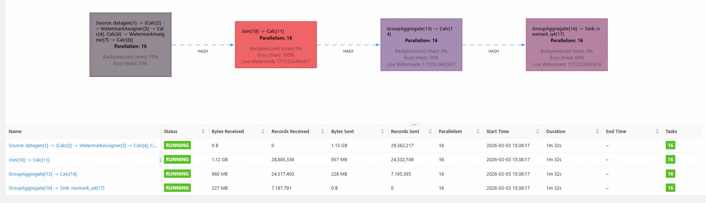
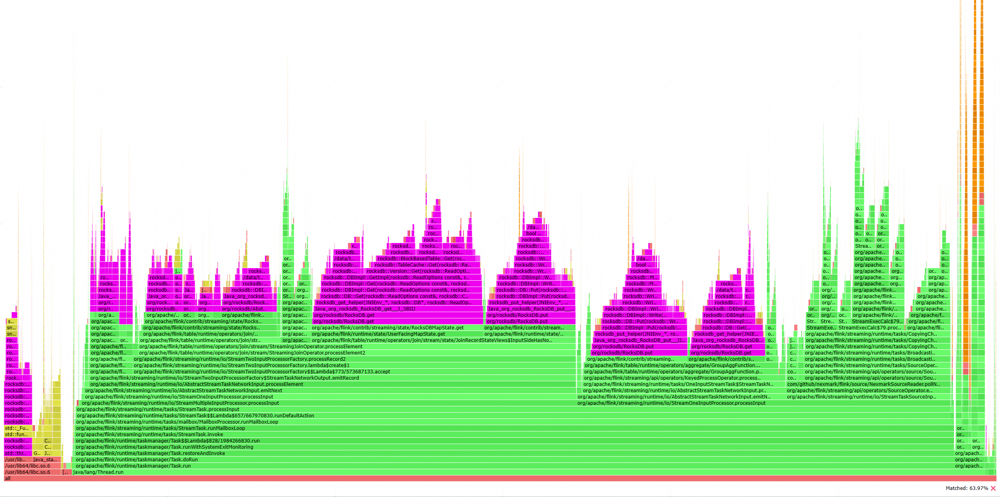

# OmniStateStore Best Practices

Learn best practice examples of OmniStateStore. These examples help you quickly understand its application scenarios and performance benefits.

## Operating Environment

In this example, the performance benefits of OmniStateStore are verified on a Kunpeng 920 server. The following table lists the hardware and software specifications for task running.

**Table 1** Hardware and software configurations

<table>
  <thead>
    <tr>
      <th style="text-align: left;">Item</th>
      <th style="text-align: left;">Version</th>
    </tr>
  </thead>
  <tbody>
    <tr>
      <td style="text-align: left;">Processor</td>
      <td style="text-align: left;">Kunpeng 920</td>
    </tr>
    <tr>
      <td style="text-align: left;">Drive</td>
      <td style="text-align: left;">NVMe SSD</td>
    </tr>
    <tr>
      <td style="text-align: left;">OS</td>
      <td style="text-align: left;">openEuler 22.03 LTS SP3</td>
    </tr>
    <tr>
      <td style="text-align: left;">Kernel</td>
      <td style="text-align: left;">5.10.0182.0.0.95.oe2203sp3.aarch64</td>
    </tr>
    <tr>
      <td style="text-align: left;">GCC</td>
      <td style="text-align: left;">10.3.1</td>
    </tr>
    <tr>
      <td style="text-align: left;">JDK</td>
      <td style="text-align: left;">BiSheng JDK 1.8.0_432</td>
    </tr>
    <tr>
      <td style="text-align: left;">Maven</td>
      <td style="text-align: left;">Apache Maven 3.6.3</td>
    </tr>
    <tr>
      <td style="text-align: left;">Flink</td>
      <td style="text-align: left;">1.16.3</td>
    </tr>
    <tr>
      <td style="text-align: left;">FRocksDB</td>
      <td style="text-align: left;">6.20.3</td>
    </tr>
    <tr>
      <td style="text-align: left;">Nexmark</td>
      <td style="text-align: left;">0.2</td>
    </tr>
  </tbody>
</table>

## Flink Deployment Method

In this example, the Flink cluster is deployed using containers. Specifically, one JobManager container and two TaskManager containers are deployed, each with a flavor of 8C32GB. Each TaskManager container hosts four TaskManagers, with each TaskManager configured with two slots. Each of the JobManager and TaskManagers is allocated 8 GB of memory.

The Flink configuration used in this example is as follows:

```text
taskmanager.memory.process.size: 8G
jobmanager.rpc.address: 172.19.0.2
jobmanager.rpc.port: 6123
jobmanager.memory.process.size: 8G
taskmanager.numberOfTaskSlots: 2
parallelism.default: 16
io.tmp.dirs: /data/tmp

state.backend: rocksdb
state.backend.rocksdb.localdir: /data/rocksdb
state.backend.incremental: true
```

## Test Case

This example test is based on the Nexmark 0.2 Q4 case. For instructions on downloading Nexmark, click [Download Link](https://github.com/nexmark/nexmark/releases/tag/v0.2.0). For details about how to use Nexmark, see [Usage Description](#Nexmark Usage Description).

In this test case, dual-stream Join + AGG is used. The following figure shows the test result.

**Figure 1** Running the Nexmark Q4 case

<a href="./figures/Nexmark_task_screenshot.png"></a>

RocksDBMapState is used for the dual-stream join operation, and RocksDBValueState is used for the AGG operation. Based on the collected flame graph data, RocksDB accounts for over 60% of the execution time, making it the primary performance bottleneck in this test case.  

**Figure 2** CPU flame graph of the Nexmark Q4 case

<a href="./figures/Nexmark_task_flame_graph.png"></a>

To generate a sufficient number of states for evaluating the acceleration effect of OmniStateStore, this example runs Nexmark with 100 million data records. For details about the Nexmark configuration file example, see [nexmark.yaml](#Nexmark usage description).

## OmniStateStore Practice

In this example, OmniStateStore is installed and enabled based on [Installation Guide](installation_guide.md) and [User Guide](user_guide.md). If the following log information is displayed in the Flink log, OmniStateStore is successfully enabled.

```text
2026-03-03 16:00:52,972 INFO  org.apache.flink.runtime.taskexecutor.TaskExecutor           [] - [FALCON] configuring falcon cache heap memory management system. current TM have 2 slots, so each slot can cache 10000 states.
2026-03-03 16:00:53,057 INFO  org.apache.flink.runtime.taskexecutor.TaskExecutor           [] - [FALCON] configuring falcon cache heap memory management system. current TM have 2 slots, so each slot can cache 10000 states.
2026-03-03 16:00:53,068 INFO  org.apache.flink.runtime.taskexecutor.TaskExecutor           [] - [FALCON] configuring falcon cache heap memory management system. current TM have 2 slots, so each slot can cache 10000 states.
2026-03-03 16:00:53,200 INFO  org.apache.flink.runtime.taskexecutor.TaskExecutor           [] - [FALCON] configuring falcon cache heap memory management system. current TM have 2 slots, so each slot can cache 10000 states.
2026-03-03 16:00:53,219 INFO  org.apache.flink.runtime.taskexecutor.TaskExecutor           [] - [FALCON] configuring falcon cache heap memory management system. current TM have 2 slots, so each slot can cache 10000 states.
2026-03-03 16:00:53,252 INFO  org.apache.flink.runtime.taskexecutor.TaskExecutor           [] - [FALCON] configuring falcon cache heap memory management system. current TM have 2 slots, so each slot can cache 10000 states.
2026-03-03 16:00:53,317 INFO  org.apache.flink.runtime.taskexecutor.TaskExecutor           [] - [FALCON] configuring falcon cache heap memory management system. current TM have 2 slots, so each slot can cache 10000 states.
2026-03-03 16:00:53,364 INFO  org.apache.flink.runtime.taskexecutor.TaskExecutor           [] - [FALCON] configuring falcon cache heap memory management system. current TM have 2 slots, so each slot can cache 10000 states.
2026-03-03 16:00:54,202 INFO  org.apache.flink.optimizer.Optimizer                         [] - [FALCON] subTask 452769245d6eb1c1f65f53c5004299eb_14_0's slot have 4 subTasks, so each subTask can cache 2500 states.
2026-03-03 16:00:54,223 INFO  org.apache.flink.optimizer.Optimizer                         [] - [FALCON] subTask 29c6de9b0f6c5486908e9bb66a93ee45_14_0's slot have 4 subTasks, so each subTask can cache 2500 states.
2026-03-03 16:00:54,224 INFO  org.apache.flink.optimizer.Optimizer                         [] - [FALCON] subTask 452769245d6eb1c1f65f53c5004299eb_5_0's slot have 4 subTasks, so each subTask can cache 2500 states.
2026-03-03 16:00:54,228 INFO  org.apache.flink.optimizer.Optimizer                         [] - [FALCON] subTask 987497bfc681cca54be4ca4b6cce3386_5_0's slot have 4 subTasks, so each subTask can cache 2500 states.
2026-03-03 16:00:54,229 INFO  org.apache.flink.optimizer.Optimizer                         [] - [FALCON] subTask 29c6de9b0f6c5486908e9bb66a93ee45_5_0's slot have 4 subTasks, so each subTask can cache 2500 states.
2026-03-03 16:00:54,248 INFO  org.apache.flink.optimizer.Optimizer                         [] - [FALCON] subTask 987497bfc681cca54be4ca4b6cce3386_14_0's slot have 4 subTasks, so each subTask can cache 2500 states.
2026-03-03 16:00:54,642 INFO  org.apache.flink.table.runtime.operators.join.stream.state.JoinRecordStateViews [] - [FALCON] merge optimization is used for left-records.
2026-03-03 16:00:54,645 INFO  org.apache.flink.table.runtime.operators.join.stream.state.JoinRecordStateViews [] - [FALCON] merge optimization is used for left-records.
2026-03-03 16:00:54,678 INFO  com.huawei.falcon.state.RocksDBRuntimeOption                 [] - [FALCON] left-records is map, use range filter.
2026-03-03 16:00:54,682 INFO  com.huawei.falcon.state.RocksDBRuntimeOption                 [] - [FALCON] left-records is map, use range filter.
2026-03-03 16:00:54,691 INFO  com.huawei.falcon.state.RocksDBRuntimeOption                 [] - [FALCON] accState is valueState, use HashLinkList as memTable structure.
2026-03-03 16:00:54,703 INFO  com.huawei.falcon.state.RocksDBRuntimeOption                 [] - [FALCON] accState is valueState, use HashLinkList as memTable structure.
2026-03-03 16:00:54,705 INFO  com.huawei.falcon.state.RocksDBRuntimeOption                 [] - [FALCON] accState is valueState, use HashLinkList as memTable structure.
2026-03-03 16:00:54,709 INFO  org.apache.flink.table.runtime.operators.join.stream.state.JoinRecordStateViews [] - [FALCON] merge optimization is used for right-records.
2026-03-03 16:00:54,712 INFO  com.huawei.falcon.state.RocksDBRuntimeOption                 [] - [FALCON] right-records is map, use range filter.
2026-03-03 16:00:54,713 INFO  org.apache.flink.table.runtime.operators.join.stream.state.JoinRecordStateViews [] - [FALCON] merge optimization is used for right-records.
2026-03-03 16:00:54,715 INFO  com.huawei.falcon.state.RocksDBRuntimeOption                 [] - [FALCON] right-records is map, use range filter.
2026-03-03 16:00:54,726 INFO  org.apache.flink.streaming.api.operators.AbstractStreamOperator [] - [FALCON] enable miniBatch process for StreamingJoinOperator.
2026-03-03 16:00:54,730 INFO  org.apache.flink.streaming.api.operators.AbstractStreamOperator [] - [FALCON] enable miniBatch process for StreamingJoinOperator.
2026-03-03 16:00:54,830 INFO  com.huawei.falcon.state.RocksDBRuntimeOption                 [] - [FALCON] accState is valueState, use HashLinkList as memTable structure.
2026-03-03 16:00:54,834 INFO  org.apache.flink.contrib.streaming.state.RocksDBKeyedStateBackend [] - [FALCON] <accState, VALUE> enable falcon cache, and update falcon cache size of each state to 2500.
2026-03-03 16:00:54,837 INFO  org.apache.flink.contrib.streaming.state.RocksDBKeyedStateBackend [] - [FALCON] <accState, VALUE> enable falcon cache, and update falcon cache size of each state to 2500.
2026-03-03 16:00:54,838 INFO  org.apache.flink.contrib.streaming.state.RocksDBKeyedStateBackend [] - [FALCON] <accState, VALUE> enable falcon cache, and update falcon cache size of each state to 2500.
2026-03-03 16:00:54,855 INFO  org.apache.flink.contrib.streaming.state.RocksDBKeyedStateBackend [] - [FALCON] <accState, VALUE> enable falcon cache, and update falcon cache size of each state to 2500.
```

When running the Nexmark 0.2 Q4 test case on native Flink, the single-core task throughput is 20.52. After OmniStateStore is enabled, the single-core throughput increases to 37.26. **Using single-core throughput as the performance metric, OmniStateStore improves performance by 81.58%.**

## Nexmark Usage Description

1. Download the [Nexmark software package](https://github.com/nexmark/nexmark/releases/tag/v0.2.0).

2. Deploy the Nexmark software package in the environment, for example, in the **/opt** directory.

    ```shell
    cd /opt
    unzip nexmark-flink.zip
    rm -rf nexmark-flink.zip
    mv nexmark-flink nexmark
    ```

3. Deploy the Nexmark JAR package to the **lib** directory of Flink.

    ```shell
    cp -r /opt/nexmark/lib/nexmark-flink-0.2-SNAPSHOT.jar $FLINK_HOME/lib/
    ```

4. Modify the Nexmark test configuration, that is, modify the **/opt/nexmark/conf/nexmark.yaml** file. The configuration example is as follows:

    ```text
    # The metric reporter server host.
    nexmark.metric.reporter.host: 172.19.0.2
    # The metric reporter server port.
    nexmark.metric.reporter.port: 9098

    #==============================================================================
    # Benchmark workload configuration (events.num)
    #==============================================================================

    nexmark.workload.suite.100m.events.num: 100000000
    nexmark.workload.suite.100m.tps: 10000000
    nexmark.workload.suite.100m.queries: "q0,q1,q2,q3,q4,q5,q7,q8,q9,q10,q11,q12,q13,q14,q15,q16,q17,q18,q19,q20,q21,q22"
    nexmark.workload.suite.100m.queries.cep: "q0,q1,q2,q3"
    nexmark.workload.suite.100m.warmup.duration: 120s
    nexmark.workload.suite.100m.warmup.events.num: 50000000
    nexmark.workload.suite.100m.warmup.tps: 10000000

    #==============================================================================
    # Benchmark workload configuration (tps, legacy mode)
    # Without events.num and with monitor.duration
    # NOTE: The numerical value of TPS is unstable
    #==============================================================================

    # When to monitor the metrics, default 3min after job is started
    # nexmark.metric.monitor.delay: 3min
    # How long to monitor the metrics, default 3min, i.e. monitor from 3min to 6min after job is started
    # nexmark.metric.monitor.duration: 3min

    # nexmark.workload.suite.10m.tps: 10000000
    # nexmark.workload.suite.10m.queries: "q0,q1,q2,q3,q4,q5,q7,q8,q9,q10,q11,q12,q13,q14,q15,q16,q17,q18,q19,q20,q21,q22"

    #==============================================================================
    # Workload for data generation
    #==============================================================================

    nexmark.workload.suite.datagen.tps: 10000000
    nexmark.workload.suite.datagen.queries: "insert_kafka"
    nexmark.workload.suite.datagen.queries.cep: "insert_kafka"

    #==============================================================================
    # Flink REST
    #==============================================================================

    flink.rest.address: 172.19.0.2
    flink.rest.port: 8081

    #==============================================================================
    # Kafka config
    #==============================================================================

    # kafka.bootstrap.servers: ***:9092

    nexmark.metric.monitor.delay: 8s
    ```

5. Start the Flink cluster and run the specified Nexmark test case.

    ```shell
    cd $FLINK_HOME/bin && ./start-cluster.sh
    cd /opt/nexmark/bin && ./setup_cluster.sh
    ./run_query.sh q4
    ./shutdown_cluster.sh
    cd $FLINK_HOME/bin && ./stop-cluster.sh
    ```
