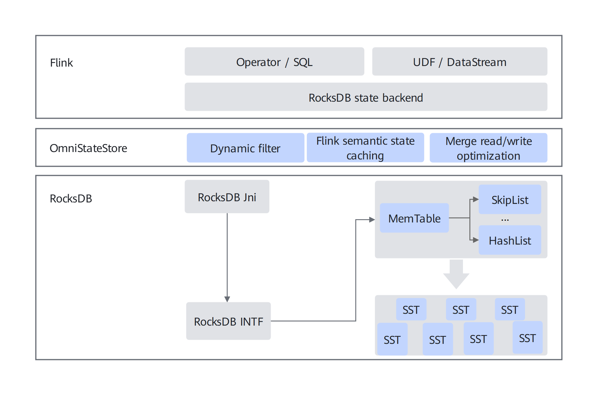
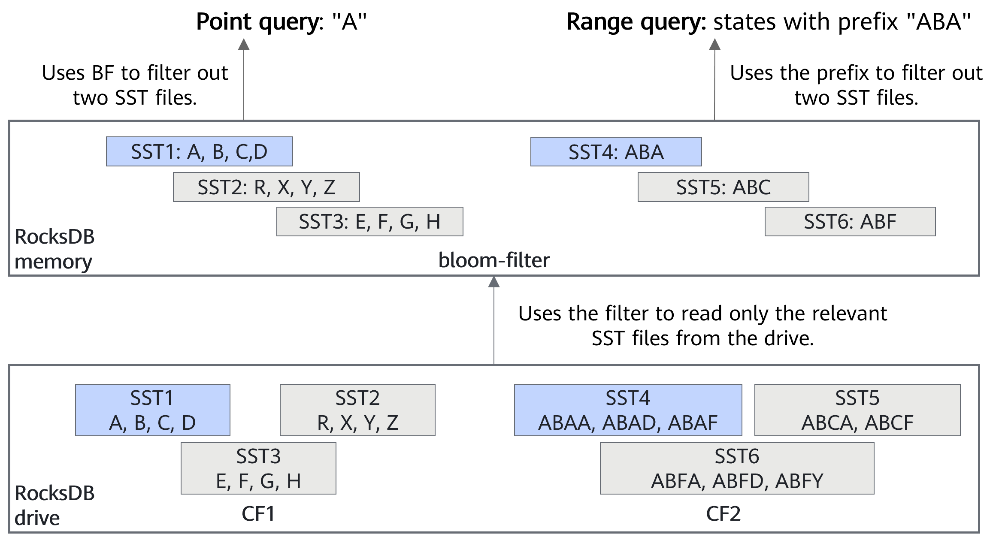
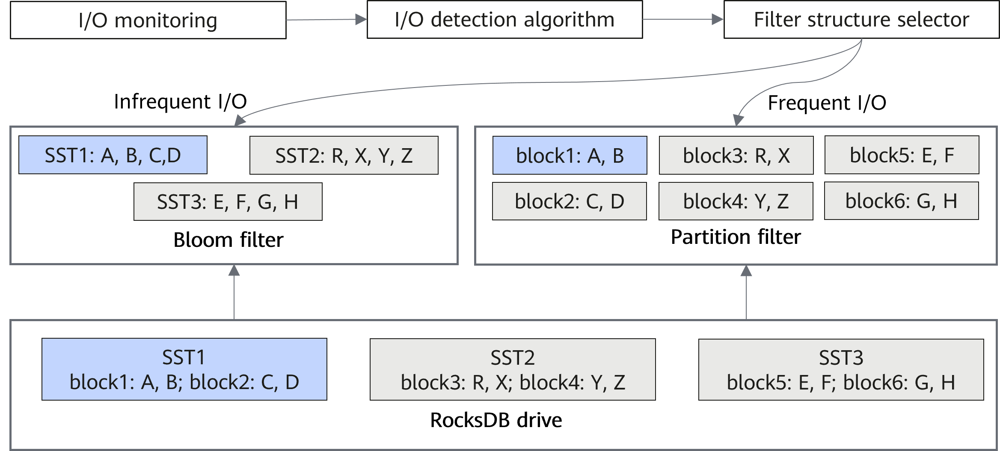
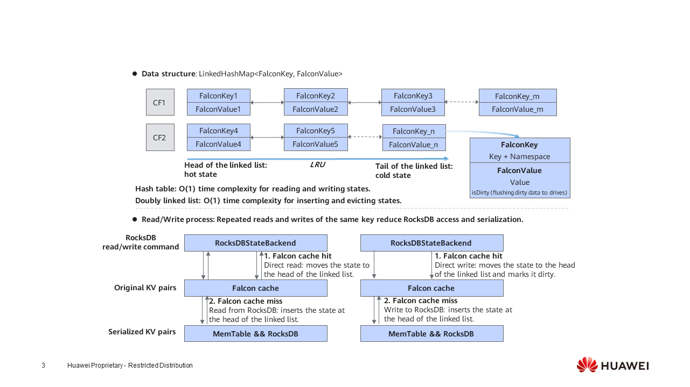
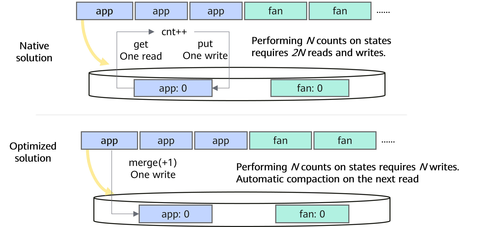
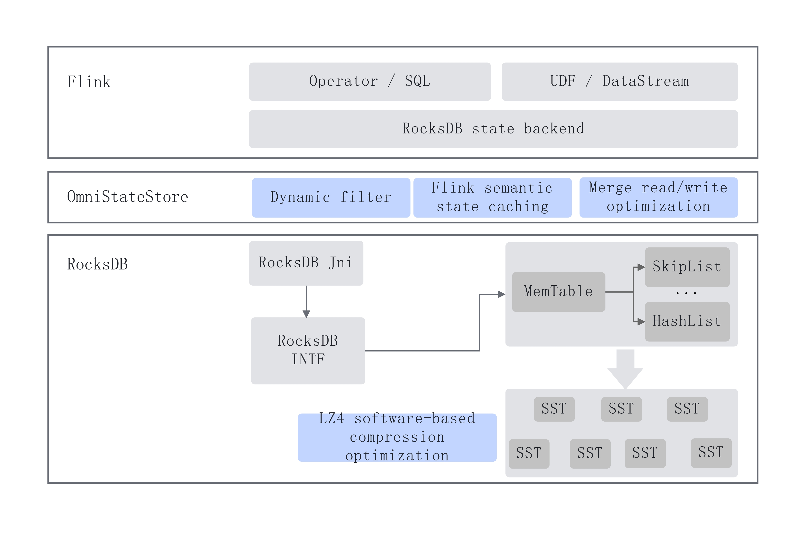

# Design Guide

This document provides a design guide for OmniStateStore, helping users quickly understand its system architecture and acceleration features.

## System Architecture of OmniStateStore

OmniStateStore interfaces with the Flink RocksDB state backend API in the northbound direction and with RocksDB in the southbound direction. Lightweight modifications to Flink reduce the frequency of RocksDB accesses as well as state compression/decompression overhead, improving end-to-end performance in stateful workloads.

OmniStateStore is designed for the Flink + RocksDB architecture. As a middle-layer plugin between Flink and RocksDB, it supports both SQL and DataStream scenarios. The following figure shows the system architecture:

**Figure 1** System architecture of OmniStateStore

## Key Technologies of OmniStateStore

### Flink Intelligent Multi-stream Awareness Algorithm

RocksDB's MemTable supports two data structures: the skip list and the hash linked list, with the skip list used by default.

For state operations that include point reads, point writes, and range queries, the skip list is generally efficient, providing relatively low time complexity for each operation. However, if the state includes only a point read operation and a point write operation, time complexity of the skip table is O (logn), which is not optimal.

To address this, Flink's intelligent multi-stream awareness algorithm dynamically switches the MemTable structure of the RocksDBValueState type from a skip list to a hash linked list, minimizing read and write time complexity.

### Dynamic Filter

**Filter Mechanisms of RocksDB**

RocksDB typically uses a block cache to accelerate state query operations. A core part of this mechanism is the filter: before accessing the actual state data, the filter in the block cache is checked first. If the filter indicates that the requested state is not present in RocksDB, the subsequent disk lookup is skipped, reducing I/O overhead. Specifically, RocksDB provides two types of filters to accelerate read operations, as illustrated in the figure below:

**- Using a Bloom filter to accelerate point query operations**

When a state query operation is performed, the Bloom filter in memory is checked first. If the filter returns "true", the corresponding SSTable is read from the drive to complete the state query. If the filter returns "false", it indicates that the SSTable does not contain the requested state, and the drive read is skipped. As illustrated in the figure below, using the Bloom filter for a point query on state A can eliminate two unnecessary SSTable reads.

**- Using a range filter to accelerate range query operations**

When a state range query operation is performed, the key prefix of the state to be queried is first extracted, and the range filter in memory is checked. If the filter returns "true", the key prefix exists in RocksDB, and the corresponding SSTable is read from the drive to complete the range query. If the filter returns "false", the SSTable does not contain the requested key prefix, and the drive read is skipped. As illustrated in the figure below, using the range filter for a query with `ABA` as the key prefix can eliminate two unnecessary SSTable queries.

**Figure 2** Flink filter principle

The filters provided by RocksDB have the following limitations in Flink scenarios:

**- In random read/write scenarios, using a Bloom filter can significantly degrade system performance.** For example, frequent compaction operations on RocksDB SSTables cause the in-memory filters to become invalid frequently. As a result, new filters must be repeatedly rebuilt for the updated SSTables. In the Nexmark 0.2 Q15 test case, enabling the Bloom filter increases the filter miss rate by a factor of 10, leading to a roughly 10× decrease in overall system performance.

**- If the length of the range query key is shorter than the length configured for the range filter, the query result may be incorrect.** For example, if a range query targets states prefixed with `AB` and the range filter length is set to 3, the filter may incorrectly determine that no state with the `AB` prefix exists in RocksDB. This misjudgment leads to an incorrect range query result.

**Dynamic Filter**

To address these issues, OmniStateStore introduces the dynamic filter technology to accelerate both state point queries and range queries. Specifically, the dynamic filter technology can be divided into the following two subfeatures:

**- I/O-driven dynamic filter policy**
In random read/write scenarios, the partition filter is used to replace the Bloom filter for accelerating state reads. Unlike the Bloom filter, which constructs a filter at the granularity of an entire SSTable—resulting in relatively high I/O overhead—the partition filter builds a filter at the granularity of an individual block within an SSTable. This makes the I/O operations required to construct the filter significantly more lightweight. The figure below illustrates the details of this approach:

**- Adaptive range filter policy**
When key lengths in the dataset are inconsistent, the filter dynamically determines the appropriate key length. If the range query key is longer than the filter length, prefix optimization is enabled. Conversely, if the range query key is shorter than the filter length, prefix optimization is disabled.

**Figure 3** OmniStateStore partition filter principle

## Flink Semantic State Caching Algorithm

**State Read and Write Mechanism of RocksDBValueState**

RocksDBVauleState is a commonly used state type in Flink. The state is stored in RocksDB as key-value (KV) pairs, where K contains the key and the window namespace specified by the task, and V contains the task-specified value.

**Flink Semantic State Caching Algorithm**

In Flink workloads, the K of RocksDBValueState is not globally unique. Each state access with the same K requires interaction with RocksDB, making drive I/O the main performance bottleneck. To address this, the algorithm introduces an in-memory state cache. States with the same K are preferentially aggregated in the cache to reduce the frequency of RocksDB accesses. The cache has a fixed size. When the cache exceeds its capacity, a Least Recently Used (LRU) policy evicts the state that has not been accessed for the longest time, writing it back to RocksDB. To maintain data consistency, cached states are also flushed to RocksDB before each checkpoint.

Specifically, LinkedHashMap is used as the underlying data structure for the state cache. This ensures that the time complexity for state read, write, deletion, and eviction operations is O(1). State read, write, and deletion operations first access the state cache, consulting RocksDB only on cache misses.

**Figure 4** Principle of the Flink semantic state caching algorithm

### Dual-Stream Join Data Cache Algorithm

**Processing Logic of the Flink Dual-Stream Join Operator**

The join process of Flink StreamingJoinOperator includes the following steps:

- Extract the join key from the input data.
- Perform a range query in the target table's RocksDB to retrieve states prefixed with the join key.
- Join the input data with the retrieved results sequentially and output the join results.
- Update the RocksDB state of the input table based on the input data.

**Limitations**

In dual-stream join operations, the join key is not globally unique. As a result, range queries must be repeatedly executed for records with the same join key. For multiple consecutive input records sharing the same join key, the system repeatedly performs range queries on RocksDB, even though the query results remain unchanged.

However, state range queries incur significant overhead. First, a binary search is performed on the drive based on the query prefix. Then, a sequential scan is required to traverse the relevant range until all matching states are retrieved. Consequently, in dual-stream join operations, state range queries often become a primary performance bottleneck.

**Processing Logic of the OmniStateStore Dual-Stream Join Operator**

The join process of Flink StreamingJoinOperator includes the following steps:

- Extract the join key from the input data, insert the data into a cache, and aggregate records based on the join key. When the cache capacity exceeds a predefined threshold, a batch join operation is triggered.
- For each batch of records sharing the same join key, perform a range query on the target table's RocksDB to retrieve all states with the corresponding key prefix.
- Join the batch of input records with the retrieved results and output the join results.
- Update the RocksDB state of the input table using the batch of records with the same join key.

### Merge Read/Write Optimization

**Limitations**

Flink state counting operations require multiple reads from and writes to RocksDB. For example, in the Nexmark 0.2 Q9 test case, state-related operations account for up to 20% of CPU usage.

**Merge Optimization Principle of OmniStateStore**

The following figure shows the principle of merge optimization. The main principle is to use the merge interface of RocksDB to replace the read and write operations of state update and change the write state value to the write state accumulation operation. In this manner, one state read and one state write may be reduced to one state write. When the state is read again or a compaction operation is triggered, the actual state merge is performed in the background.

**Figure 5** Merge read/write optimization algorithm

### LZ4 Software-based Compression Optimization

**Limitations**

When Flink writes state data to RocksDB, the data is first written to the in-memory MemTable. Once the MemTable is full, it is flushed to drives as SST files for persistent storage. On drives, SST files are organized in an LSM-tree structure. When SST files at a given level become full, compaction is triggered to merge them into higher levels. In this process, state data is compressed when being flushed from the MemTable to L0, as well as during compaction across SST levels. Similarly, when reading raw state data from SST files, decompression is required.

By default, Flink uses the Snappy algorithm for compression and decompression. However, in large-state workloads such as Nexmark, compression and decompression often become major performance bottlenecks. For example, in the Nexmark Q9 workload, these operations can account for over 20% of CPU usage.

**Principle**

The following figure shows the principle of LZ4 software-based compression optimization. The core idea is to replace the compression algorithm used for RocksDB L0/L1 levels with the more efficient LZ4 algorithm, thereby improving state compression and decompression efficiency while maintaining nearly the same compression ratio.

It is important to note that replacing the compression format for all SST levels with LZ4 is generally not recommended. In large-scale data scenarios, the data volume at the L6 level can reach terabytes, which may lead to increased drive space usage.

**Figure 6** LZ4 software-based compression optimization

