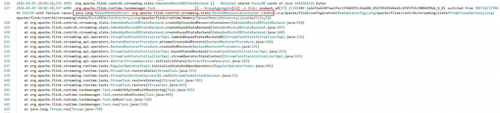
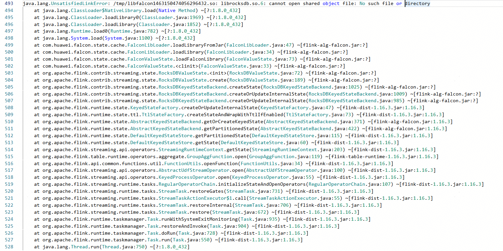
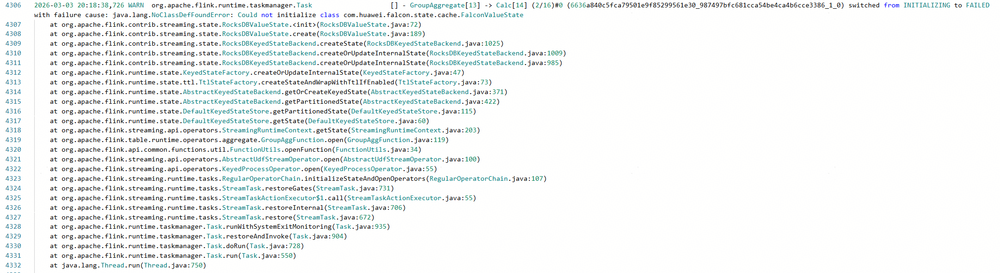

# FAQs
<font size=3>Learn about common issues that may occur during the installation and enabling of OmniStateStore, along with their solutions.</font>


## Tasks Cannot Be Started Because the OmniStateStore and Flink Versions Do Not Match
<font size=3>

**Symptom<br>**
When running the Nexmark 0.2 Q4 test case with Flink 1.16.1 and attempting to enable OmniStateStore, the class constructor cannot be found. See the following figure:<br>

**Figure 1** OmniStateStore error information

<a href="./figures/OmniStateStore faq1.png"></a>

**Cause<br>**
OmniStateStore supports only Flink 1.16.3 with FRocksDB 6.20.3. It requires lightweight modifications to the Flink codebase. However, if a different Flink version is used or the codebase is modified independently, conflicts may arise.<br>
Specifically, OmniStateStore modifies the class that contains RocksDBResourceContainer. Meanwhile, the corresponding class in Flink 1.16.1 has also been changed (based on Flink 1.16.3), leading to conflicting implementations. During task execution, the class with the same name from OmniStateStore is loaded with higher priority. As a result, the expected constructor of RocksDBResourceContainer cannot be found.

**Solution<br>**
Adopt one of the following solutions:<br>Solution 1: Roll back to Flink 1.16.3 and run a test.<br>Solution 2: Merge the modifications from Flink 1.16.1 into OmniStateStore, then recompile, package the code, and run a test.

</font>


## Task Startup Failure Due to Incorrect OmniStateStore Deployment
<font size=3>

**Symptom<br>**
**librocksdb.so.6** fails to load during Flink task execution, causing the task to fail. See the following figure:<br>

**Figure 2** Job Manager error information

<a href="./figures/OmniStateStore faq2-1.png"></a>


**Figure 3** Task Manager error information

<a href="./figures/OmniStateStore faq2-2.png"></a>

**Cause<br>**
OmniStateStore depends on **librocksdb.so.6**. Flink tasks load the dynamic library from the **LD_LIBRARY_PATH** directory. If the dynamic library is not deployed in the specified path as required or the **LD_LIBRARY_PATH** environment variable is not correctly set, the task fails to be executed.

**Solution<br>**
1. Check the **LD_LIBRARY_PATH** environment variable and copy **librocksdb.so.6** to the specified directory.
```
echo $LD_LIBRARY_PATH  # Output result example: **/usr/local/lib**
ll /usr/local/lib  # Check whether **librocksdb.so.6** is included.
```
2. If **librocksdb.so.6** is not contained, copy it to a specified directory.
```
mv librocksdb.so.6 /usr/local/lib
```

</font>
