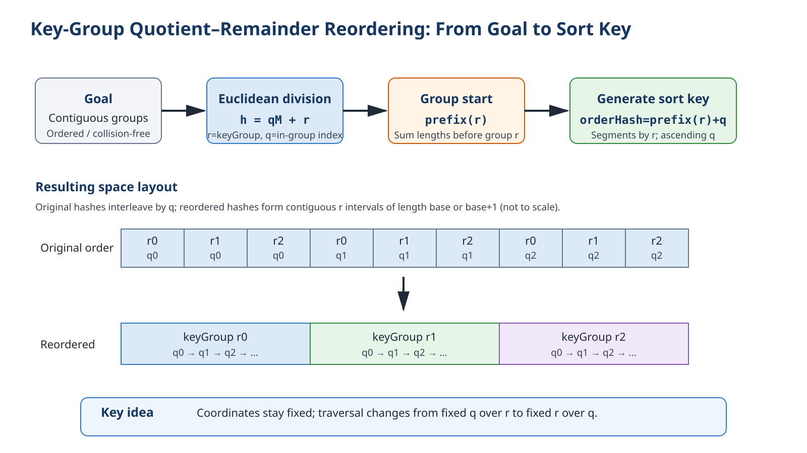
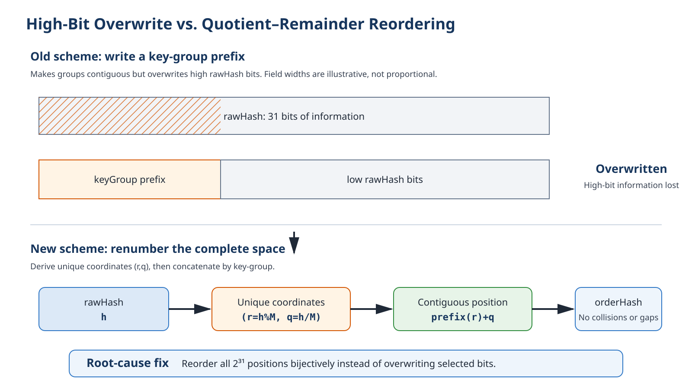
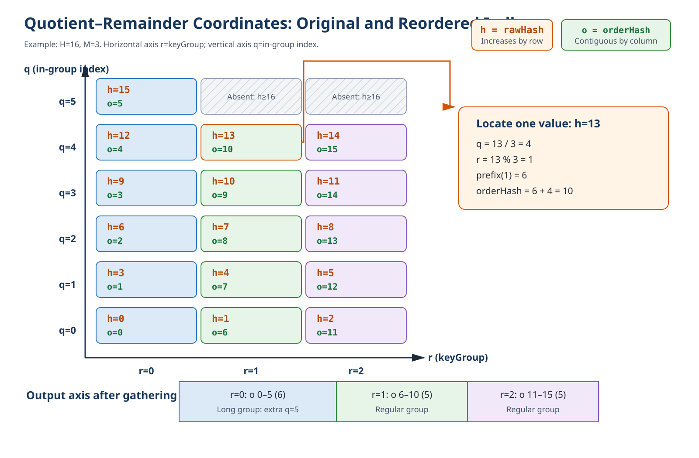
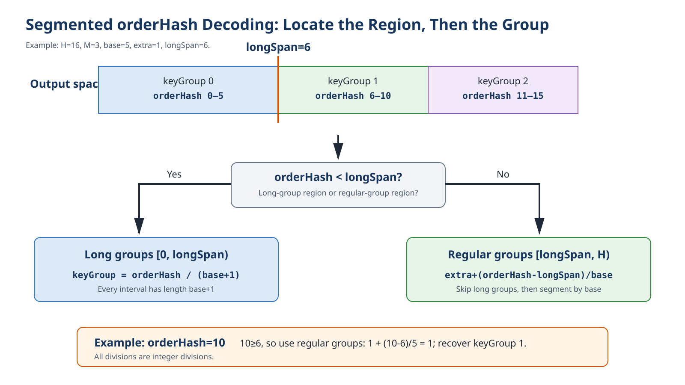
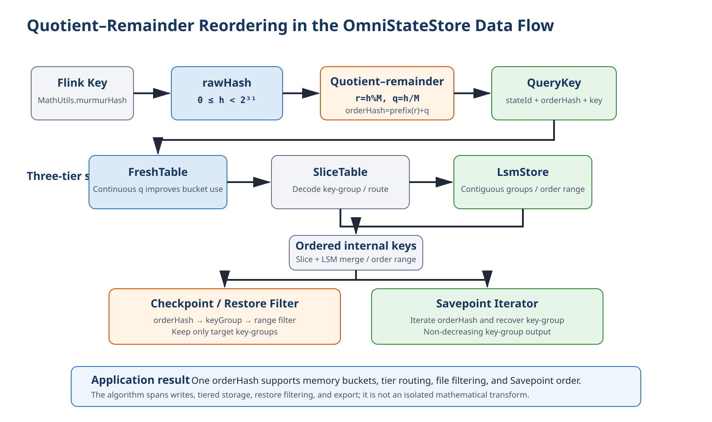

# Key-Group Quotient–Remainder Reordering Algorithm

> Applicable commit: `75453e4a1a3d8461a2e0ec5c4c476c70464ab2c4`
>
> Scope: This document describes the `rawHash → orderHash → keyGroup` mapping for regular state. Priority Queue (PQ) retains its independent encoding and is outside the scope of this algorithm.

## 1. Executive Summary

The old scheme wrote the key-group into the high bits of the hash, overwriting part of the original hash. When `maxParallelism` was large, different `rawHash` values could receive the same encoding, and a single key-group could use only a small number of FreshTable buckets.

The new scheme preserves the hash-space size and losslessly reorders the complete 31-bit space:

```text
h = qM + r

r = h % M                  // keyGroup
q = h / M                  // index within the group
orderHash = prefix(r) + q  // start of group r + offset within the group
```

| Goal | Result |
| --- | --- |
| Preserve information | One-to-one mapping over `[0, 2^31)`, with no overwrites or collisions |
| Keep groups contiguous | Each key-group maps to one contiguous `orderHash` interval |
| Preserve in-group order | `rawHash` and `orderHash` have the same order within a key-group |
| Recover grouping | The key-group can be recovered directly from `orderHash` |
| Preserve space usage | No increase in internal key length or per-KV storage |
| Provide a fast path | When `M` is a power of two, the calculation reduces to shifts and bitwise OR |

**Figure 1. Algorithm overview**



> **NOTICE:**
>Quotient–remainder reordering does not recompute the hash. It changes the traversal order from **row by row in quotient order** to **column by column in remainder order**.

## 2. Background: Preserve the Hash While Making Key-Groups Contiguous

Flink partitions Keyed State as follows:

```text
keyGroup = hash(key) % maxParallelism
```

OmniStateStore's internal sort key serves writes, tiered storage, file filtering, and Savepoint iteration. It therefore needs the following properties:

| Dimension | Required property |
| --- | --- |
| Hash semantics | The same application key has a stable encoding, and encoding does not discard information from distinct 31-bit hashes |
| Ordering semantics | Sort first by key-group, then by the original hash within each group |
| Restore semantics | Checkpoint/Restore and Savepoint can recover the key-group from an internal key |
| Storage semantics | Low bits still vary sufficiently for a fixed key-group, avoiding FreshTable bucket degeneration |

Let:

```text
H = 2^31
M = maxParallelism, 1 <= M <= 32768
h = rawHash,        0 <= h < H
```

> **NOTICE:**
>Throughout this document, `/` denotes non-negative integer division and `%` denotes the corresponding non-negative remainder.

The goal is to construct `E_M: [0,H) → [0,H)`. For any distinct inputs `h1` and `h2`, the ordering must satisfy:

```text
E_M(h1) < E_M(h2)
⇔
(h1 % M, h1) <lex (h2 % M, h2)
```

A decoding function `D_M` must also exist:

```text
D_M(E_M(h)) = h % M
```

### 2.1 Root Cause of the Old Scheme's Problem

Before this change, regular state reused PQ's one- or two-byte prefix encoding and wrote the key-group into the high bits of the hash:

```text
M < 129:   orderHash = (rawHash & 0x00FFFFFF) | (keyGroup << 24)
M >= 129:  orderHash = (rawHash & 0x0000FFFF) | (keyGroup << 16)
```

**Figure 2. Old high-bit overwrite versus new quotient–remainder reordering**



For example, with `M=32768=2^15`, fixing the key-group also fixes the low 15 bits of `rawHash`. The old two-byte encoding retains only the low 16 bits, leaving only one effective bit for the index within the group. The direct consequences are:

- Different `rawHash` values can map to the same `orderHash`.
- Data for a fixed key-group is concentrated in a small number of low-bit FreshTable buckets.
- The overwritten original information cannot be recovered.

The root cause is not an insufficient number of bits. It is the attempt to create an ordering prefix by overwriting information. The correct approach is to reorder the complete space.

## 3. Deriving the Encoding from Euclidean Division

### 3.1 Split a One-Dimensional Hash into Two-Dimensional Coordinates

Euclidean division guarantees that, for any `h` and positive integer `M`, there is a unique quotient `q` and remainder `r`:

```text
h = qM + r
0 <= r < M
```

In this algorithm:

| Mathematical value | Engineering meaning |
| --- | --- |
| `r=h%M` | key-group |
| `q=h/M` | position within the current key-group |
| `(r,q)` | lossless two-dimensional coordinates of `rawHash` |

**Figure 3. Quotient–remainder coordinates and output intervals**



In the figure, the original `h` increases by row. Reading by column instead gathers each identical remainder `r` into a contiguous interval. The cells do not move; only the scan order changes.

### 3.2 Calculate Each Group's Length

`H` is not necessarily divisible by `M`. Apply Euclidean division to the hash space itself:

```text
H = base * M + extra

base  = H / M
extra = H % M
0 <= extra < M
```

The first `extra` key-groups contain one additional element each:

```text
len(r) = base + 1,  r < extra
len(r) = base,      r >= extra
```

This is not an arbitrary allocation. It is the natural frequency of each remainder in `[0,H)`.

### 3.3 Calculate the Group Start

Before group `r`, there are `r` base-length groups and `min(r,extra)` additional elements. Therefore:

```text
prefix(r) = r * base + min(r, extra)
```

`prefix(r)` is the start of key-group `r` in the output space.

### 3.4 Encoding Formula

Add the offset within the group to the group start:

```text
q = h / M
r = h % M

E_M(h)
= prefix(r) + q
= r * base + min(r, extra) + q
```

This is the general quotient–remainder reordering formula.

### 3.5 Reduced Example: `H=16, M=3`

Initialization:

```text
base  = 16 / 3 = 5
extra = 16 % 3 = 1
```

Group 0 therefore has length 6, while groups 1 and 2 have length 5:

| key-group `r` | Original hashes `h=qM+r` | Output interval |
| ---: | --- | --- |
| 0 | 0, 3, 6, 9, 12, 15 | `orderHash=[0, 5]` |
| 1 | 1, 4, 7, 10, 13 | `orderHash=[6, 10]` |
| 2 | 2, 5, 8, 11, 14 | `orderHash=[11, 15]` |

For the single value `h=13`:

```text
q = 13 / 3 = 4
r = 13 % 3 = 1
prefix(1) = 1 * 5 + min(1,1) = 6
orderHash = 6 + 4 = 10
```

The result is the final position in the key-group 1 interval, matching Figure 3.

## 4. Recovering the Key-Group from orderHash

The first `extra` long groups occupy:

```text
longSpan = extra * (base + 1)
```

The output space can therefore be divided into two segments:

```text
                  orderHash / (base + 1),                  orderHash < longSpan
D_M(orderHash) =
                  extra + (orderHash - longSpan) / base,   orderHash >= longSpan
```

**Figure 4. Segmented orderHash decoding**



In the `H=16, M=3` example, `longSpan=6`. Because `orderHash=10>=6`:

```text
keyGroup = 1 + (10 - 6) / 5 = 1
```

The decoded result equals the original `13%3`.

## 5. Power-of-Two Fast Path

When `M=2^g`, `H=2^31` is divisible by `M`, so:

```text
base = 2^(31-g)
extra = 0
```

Quotient–remainder reordering then becomes equivalent to swapping the two bit fields of `rawHash`:

```text
rawHash   = [ quotient: 31-g bits ][ keyGroup: g bits ]
orderHash = [ keyGroup: g bits ][ quotient: 31-g bits ]
```

The formula simplifies to:

```cpp
orderHash = (keyGroup << (31 - g)) | (rawHash >> g);
keyGroup = orderHash >> (31 - g);
```

The power-of-two path is only an equivalent optimization of the general formula when `extra=0`; it does not change the ordering semantics.

## 6. Correctness

Let the interval corresponding to group `r` be:

```text
I_r = [prefix(r), prefix(r) + len(r))
```

| Property to prove | Basis |
| --- | --- |
| Unique input coordinates | Euclidean division guarantees that every `h` corresponds to exactly one `(r,q)` |
| No collisions within a group | For fixed `r`, `orderHash=prefix(r)+q`; different `q` values produce different results |
| Ordered within a group | Both `h=qM+r` and `orderHash=prefix(r)+q` increase strictly with `q` |
| No collisions between groups | `prefix(r+1)=prefix(r)+len(r)`; adjacent intervals meet but never overlap |
| Complete coverage | `extra*(base+1)+(M-extra)*base=H`; the combined interval length equals the hash-space size |
| Output remains in range | All intervals continuously cover from 0 to `H`, so `0<=orderHash<H` |
| Grouping is recoverable | `E_M(h)` falls in exactly one `I_r`; segmented decoding returns `r=h%M` using that interval's length |

Therefore, `E_M` is a bijection over `[0,H)` and simultaneously satisfies:

```text
D_M(E_M(h)) = h % M

E_M(h1) < E_M(h2)
⇔
(h1 % M, h1) <lex (h2 % M, h2)
```

## 7. Code Implementation

### 7.1 Mathematical Values and Member Variables

| Mathematical value | Code member | Initialization site |
| --- | --- | --- |
| `M` | `mMaxParallelism` | `KeyGroupUtil::Init` |
| `H/M` | `mBase` | `KeyGroupUtil::Init` |
| `H%M` | `mExtra` | `KeyGroupUtil::Init` |
| `extra*(base+1)` | `mLongSpan` | `KeyGroupUtil::Init` |
| `g` | `mGroupBits` | `KeyGroupUtil::Init` |
| `31-g` | `mQuotientBits` | `KeyGroupUtil::Init` |

Core files:

- `src/core/common/util/key_group_util.cpp`
- `src/core/common/util/key_group_util.h`

Depending on whether `M` is a power of two, `Init` installs either the general functions or the fast-path functions. Callers do not need to distinguish between the paths.

### 7.2 General Encoding

`SetGeneralKeyGroup` corresponds directly to the formula:

```cpp
uint64_t quotient = rawHash / mMaxParallelism;
uint64_t extraBefore = keyGroup < mExtra ? keyGroup : mExtra;
uint64_t prefix = static_cast<uint64_t>(keyGroup) * mBase + extraBefore;
rawHash = static_cast<uint32_t>(prefix + quotient);
```

Intermediate values use `uint64_t`. The bijection proof guarantees that the final result remains within the 31-bit space.

### 7.3 General Decoding

`ComputeGeneralKeyGroup` distinguishes the long-group region from the regular-group region:

```cpp
uint64_t value = orderHash;
if (value < mLongSpan) {
    return static_cast<uint32_t>(value / (mBase + 1));
}
return static_cast<uint32_t>(mExtra + (value - mLongSpan) / mBase);
```

### 7.4 Write Entry Point

In `src/core/kv_table/boost_state_table.cpp`, the critical ordering in `AbstractTable::GetStateId` is:

```cpp
uint32_t keyGroupIndex = keyHashCode % mMaxParallelism;
KeyGroupUtil::SetKeyGroup(keyHashCode, keyGroupIndex);
return mStateIdHelper->GetStateId(keyGroupIndex);
```

> **NOTICE:**
>The code must first preserve `keyGroupIndex` from `rawHash`, then rewrite `keyHashCode` in place as `orderHash`. The rewritten hash is used to construct the subsequent `QueryKey`, while the preserved key-group is used to obtain the `stateId`.

### 7.5 PQ Compatibility Boundary

PQ continues to use:

```text
SetPQKeyGroup
ComputePQKeyGroupForKeyHash
```

> **NOTICE:**
>State filtering and Savepoint iteration select PQ decoding for `StateType::PQ`; regular state uses quotient–remainder reordering. The two encoding protocols must not be mixed.

## 8. Mapping to Application Flows

**Figure 5. Position of quotient–remainder reordering in the OmniStateStore data flow**



| Flow | Usage | Benefit |
| --- | --- | --- |
| KV Put/Get/Remove | Calculate the key-group from `rawHash`, then encode it into `QueryKey` | The same key produces a stable internal key, keeping write and lookup paths consistent |
| FreshTable | Select a bucket using the low bits of `orderHash` | For a fixed key-group, `q` varies continuously, allowing more low-bit buckets to be used |
| SliceTable / LsmStore | Sort, merge, and route by internal key | Data in the same group occupies a contiguous range, aligning file order ranges with key-group ranges |
| Checkpoint / Restore | Decode the key-group from `orderHash`, then apply range filtering | Filtering matches the `rawHash%M` result used during writes |
| Savepoint | Iterate internally ordered data and recover the key-group | Output key-groups are monotonically non-decreasing |

Related call sites include:

- `src/core/lsm_store/file/state_filter_manager.h`
- `src/core/lsm_store/file/file_meta_state_filter.h`
- `src/core/snapshot/binary_key_value_Item_iterator.cpp`

## 9. Verification and Boundaries

Tests in the implementation commit cover:

| Test | What it verifies |
| --- | --- |
| `KvEncodingRoundTripsRepresentativeParallelism` | Recovery without overflow for powers of two, non-powers of two, thresholds, and maximum parallelism |
| `KvOrderIsLexicographicByGroupThenRawHash` | `orderHash` is equivalent to sorting by `(keyGroup,rawHash)` |
| `PowerOfTwoLayoutMatchesExpectedBits` | The fast-path bit layout agrees with the general formula |
| `FixedGroupUsesAllAvailableFreshBuckets` | FreshTable bucket utilization for a fixed key-group |
| `PqEncodingRemainsByteCompatible` | The independent PQ encoding remains compatible |
| `InitRejectsInvalidParallelismWithoutChangingValidState` | Invalid initialization does not corrupt valid state |
| `KvOutputIsMonotonicByKeyGroup` | End-to-end Savepoint output is monotonic by key-group |

Engineering boundaries:

| Item | Constraint |
| --- | --- |
| Hash space | Only the non-negative 31-bit space `[0,2^31)` is used |
| Parallelism | `1<=maxParallelism<=32768` |
| Encoding/decoding parameters | Encoding and decoding must use the same `maxParallelism` |
| State type | Regular state and PQ use their respective protocols |
| Complexity | Encoding and decoding are both `O(1)`, with zero additional per-KV space |
