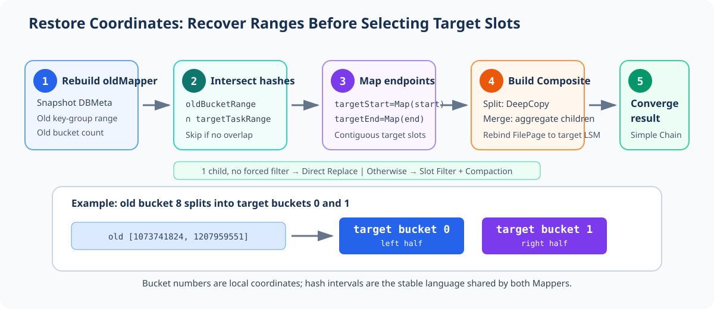
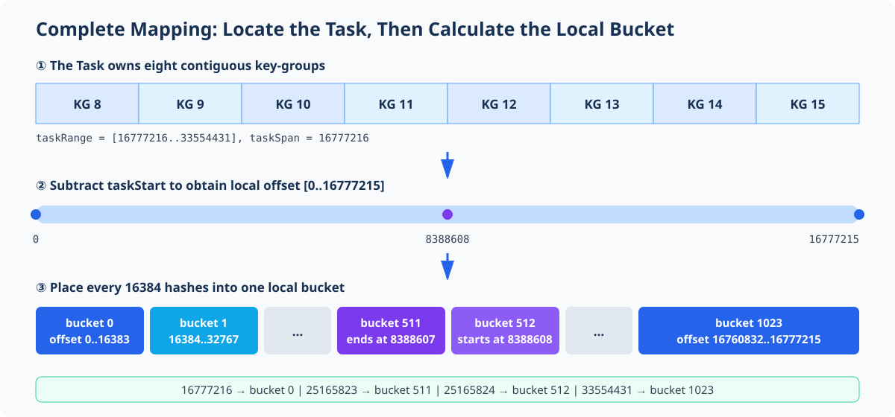
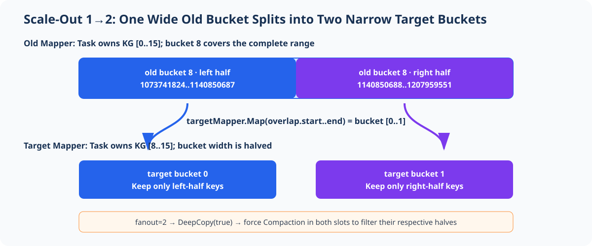
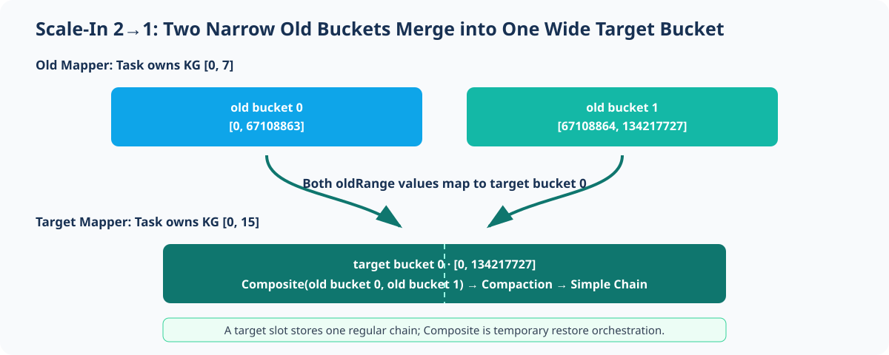
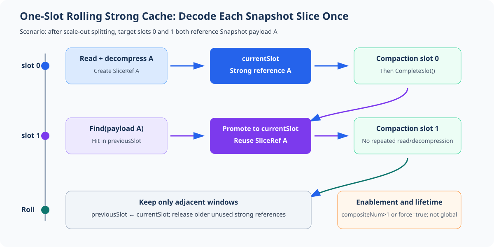

# Task-Local Slice Bucket Mapper and Rescaling Restore

> Corresponding implementation: `6b360bd40d589d32c98a8095f747a100968a83e6`
>
> Notation: Closed intervals are written as `[start..end]`; hash values do not use thousands separators.

## 1. Key Result: Identical Bucket Numbers Do Not Imply Identical Data Ranges

Each Subtask has a local Slice Bucket table of length `bucketNum`, numbered `0..bucketNum-1`. The Mapper evenly partitions the contiguous `orderHash` interval owned by that Subtask across this table.

After parallelism changes:

- The old Subtask and target Subtask have different hash ranges.
- Both sides have bucket 0, bucket 1, and so on, but buckets with the same number usually do not cover the same data range.
- Restore must compare hash intervals; it cannot simply copy a bucket with the same number.



The restore algorithm in one diagram:

```text
old bucket's hash interval
    ∩ target Task's hash interval
        → map both endpoints with targetMapper
            → obtain the target bucket range
                → assemble a Composite Chain
                    → one child and no forced filtering: replace directly
                    → otherwise: filter by target slot and run Compaction
```

## 2. Complete Mapper Example

This section uses the implementation UT parameters to walk through initialization, forward mapping, and reverse lookup:

```text
maxParallelism = 1024
startKeyGroup  = 8
endKeyGroup    = 15
bucketNum      = 1024
```

The `orderHash` here is not the original key hash. The write path first calculates the key-group as `rawHash % maxParallelism`, then rewrites the hash with `KeyGroupUtil::SetKeyGroup()` according to the quotient–remainder reordering rule. When `maxParallelism` is a power of two, an equivalent shift-based fast path is used. The rewrite preserves key-group ownership while making hashes from the same key-group contiguous over `[0..2^31-1]`. The Mapper receives the reordered `orderHash`.

In this example, each key-group covers `2^21` `orderHash` values and the current Task owns eight contiguous key-groups:

```text
taskRange = [16777216..33554431]
taskSpan  = 16777216
bucketSpan = taskSpan / bucketNum = 16384
```



### 2.1 Forward Mapping: Which Bucket Contains a Hash?

The implementation first subtracts the Task start, then scales by the Task span:

```text
offset = orderHash - taskStart
bucket = floor(offset × bucketNum / taskSpan)
```

Here, `bucketSpan=16384=2^14`, so the hot path reduces to a right shift:

```text
bucket = offset >> 14
```

| orderHash | Local offset | Calculation | bucket |
| ---: | ---: | --- | ---: |
| 16777216 | 0 | `0 >> 14` | 0 |
| 16793600 | 16384 | `16384 >> 14` | 1 |
| 25165823 | 8388607 | `8388607 >> 14` | 511 |
| 25165824 | 8388608 | `8388608 >> 14` | 512 |
| 33554431 | 16777215 | `16777215 >> 14` | 1023 |

This shows that the bucket number is **Task-local**: `16777216` maps to bucket 0 in this Task; the global hash is not taken modulo 1024 directly.

### 2.2 Reverse Lookup: Which Hashes Does a Bucket Cover?

`GetBucketRange(b)` recovers the closed interval using ceiling division:

```text
start(b) = taskStart + ceil(b × taskSpan / bucketNum)
end(b)   = taskStart + ceil((b + 1) × taskSpan / bucketNum) - 1
```

| bucket | Closed hash interval |
| ---: | --- |
| 0 | `[16777216..16793599]` |
| 1 | `[16793600..16809983]` |
| 511 | `[25149440..25165823]` |
| 512 | `[25165824..25182207]` |
| 1023 | `[33538048..33554431]` |

Forward mapping uses `floor`, while reverse boundaries use `ceil`. Both come from the same integer interval partition, so adjacent buckets meet without gaps or overlaps, and their lengths differ by at most one.

## 3. Deriving the Hash Interval from Key-Groups

### 3.1 Parallelism Determines a Subtask's Key-Group Range

Flink assigns `maxParallelism=M` key-groups contiguously to Subtasks with parallelism `P`. Subtask `i` owns:

```text
startKeyGroup(i) = ceil(i × M / P)
endKeyGroup(i)   = ceil((i + 1) × M / P) - 1
```

For example, with `M=16` and `P=2`:

| Subtask | key-group |
| ---: | --- |
| 0 | `[0..7]` |
| 1 | `[8..15]` |

This is why target Subtask 1 receives `[8..15]` in the scale-out example, while old Subtask 0 owns `[0..7]` in the scale-in example.

### 3.2 The Key-Group Range Determines the Task Hash Range

Let:

```text
H = 2^31
M = maxParallelism
base  = H / M
extra = H % M
```

The start of key-group `g` on the reordered hash axis is:

```text
GroupStart(g) = g × base + min(g, extra)
```

`extra` must not be discarded. It distributes the division remainder one by one to the first `extra` key-groups so that `[0..2^31-1]` is covered exactly.

For the Task's closed key-group interval `[startKeyGroup..endKeyGroup]`:

```text
taskStart = GroupStart(startKeyGroup)
taskEnd   = GroupStart(endKeyGroup + 1) - 1
taskSpan  = taskEnd - taskStart + 1
```

The Mapper then establishes its local bucket coordinate system only within `[taskStart..taskEnd]`. `Map()` validates that its input is in this interval; `MapUnchecked()` omits validation and is reserved for hot paths whose callers have already confirmed the range.

## 4. Application Mapping: Why Scale-Out Splits One into Many

Section 2 uses 1024 buckets to verify the real calculation. To make split boundaries easier to see, this section reduces the parameters to `maxParallelism=16` and `bucketNum=16`; the mapping formula is unchanged. For `parallelism 1→2`, old Subtask 0 owns `[0..15]`, while target Subtask 1 owns `[8..15]`.

| Mapper | key-group | Task hash range | Width per bucket |
| --- | --- | --- | ---: |
| Old Mapper | `[0..15]` | `[0..2147483647]` | 134217728 |
| Target Mapper | `[8..15]` | `[1073741824..2147483647]` | 67108864 |

The range of old bucket 8 is:

```text
oldBucket8 = [1073741824..1207959551]
```

The target Task starts at the same position, but its bucket width is halved:

```text
targetBucket0 = [1073741824..1140850687]
targetBucket1 = [1140850688..1207959551]
```



The code does not enumerate keys in the bucket. It maps only the intersection endpoints:

```text
overlapStart = max(oldRange.start, targetTaskRange.start)
overlapEnd   = min(oldRange.end,   targetTaskRange.end)

targetStart = targetMapper.MapUnchecked(overlapStart) = 0
targetEnd   = targetMapper.MapUnchecked(overlapEnd)   = 1
fanout      = 2
```

The same old chain is scheduled into two target slots. The implementation calls `DeepCopy(true)` for each copy and sets `RequireForceCompaction=true`. Each copy still contains all keys from the old bucket, so the target slot filter must retain the left and right halves separately.

## 5. Application Mapping: Why Scale-In Merges Many into One

Now consider `parallelism 2→1`. Old Subtask 0 owns key-groups `[0..7]`, while target Subtask 0 owns `[0..15]`; both still use 16 local buckets.

| Mapper | key-group | Task hash range | Width per bucket |
| --- | --- | --- | ---: |
| Old Mapper | `[0..7]` | `[0..1073741823]` | 67108864 |
| Target Mapper | `[0..15]` | `[0..2147483647]` | 134217728 |

The first two old buckets exactly cover one target bucket:

```text
oldBucket0    = [0..67108863]
oldBucket1    = [67108864..134217727]
targetBucket0 = [0..134217727]
```



Both old chains are added to target slot 0, forming a `CompositeLogicalSliceChain`. Because `GetCompositeNum()==2`, Restore must run synchronous Compaction and output a regular `LogicalSliceChain`.

### 5.1 A Single Child Can Still Require Compaction

A Task boundary can cut through the middle of an old bucket. The implementation UT contains this boundary:

```text
oldBucket341    = [715128832..717225983]
targetTaskStart = 715827883
overlap         = [715827883..717225983]
```

The intersection falls into only one target bucket, so `fanout=1`, but the old chain still contains out-of-range data in `[715128832..715827882]`. The decision therefore cannot depend only on the number of children:

```text
rangeClipped = overlap != oldBucketRange
requireForceCompaction = fanout > 1 || rangeClipped
```

The final slot filter removes two categories of keys:

```text
hash is outside the target Task range
or
targetMapper.MapUnchecked(hash) != current slot
```

## 6. How the Old and Target Mappers Cooperate During Restore

| Stage | Action | Key result |
| ---: | --- | --- |
| 1 | Read the old key-group range and bucket count from Snapshot DBMeta | Rebuild `oldMapper` |
| 2 | Initialize `SliceBucketIndex` with the current configuration | Obtain `targetMapper` |
| 3 | Iterate non-empty old buckets and intersect them with the target Task range | Skip irrelevant data |
| 4 | Map the start and end hashes of the intersection with the target Mapper | Obtain a contiguous target slot range |
| 5 | Deep-copy on split, aggregate children on merge, and rebind each FilePage's LsmStore | Build a Composite Chain |
| 6 | Load Snapshot Slices and evaluate `childNum==1 && !requireForceCompaction` | Replace directly when true; otherwise enter Compaction |
| 7 | Filter or merge by target slot, then replace the Composite Chain with a regular `LogicalSliceChain` | Complete Restore convergence |

The algorithm depends only on hash-interval intersections; old and new parallelism do not need to be integer multiples. One-to-one mapping, one-to-many splitting, many-to-one merging, and Task-boundary clipping therefore share the same code path.

## 7. Rolling Strong Cache for One Slot

The implementation enables the rolling strong cache under this condition:

```text
useRollingCache = compositeNum > 1 || requireForceCompaction
```

It therefore covers one-to-many splitting, many-to-one merging, and boundary clipping. Only the direct-replacement path with one child and no forced filtering clears the cache. One-to-many splitting shows the reuse benefit most clearly: adjacent target slots refer to the same Snapshot Slice. Reading and decompressing it again for each slot would multiply restore I/O and decompression cost by the scale-out factor.



For example, when one old chain enters target slots 0 and 1:

| Moment | `previousSlot` | `currentSlot` | Action |
| --- | --- | --- | --- |
| Start slot 0 | Empty | Empty | Read and decompress Slice A; place it in `currentSlot` |
| After slot 0 Compaction | Slice A | Empty | `CompleteSlot()` rolls the current window into the previous window |
| Start slot 1 | Slice A | Empty | `Find()` hits and promotes it to `currentSlot`; no decompression |
| After slot 1 load | Unused entries removed | Slice A | `ClearPreviousSlot()` releases leftovers from the old window |
| After slot 1 Compaction | Slice A | Empty | Continue rolling; serve only the immediately adjacent next slot |

The cache key uses the physical identity of the Snapshot payload:

```text
localAddress + startOffset + rawLength + storedLength + compressAlgo + checkSum
```

The cache holds a strong `SliceRef`, keeping the shared decoded Buffer valid until Compaction for the current slot completes. The window retains only the current slot and immediately preceding slot, preventing the cache from becoming globally resident.

Before allocating decode memory, `EnsureSliceRestoreMemory()` accounts for both the raw Buffer and compressed temporary Buffer. If capacity is insufficient, it first releases `previousSlot`, then attempts synchronous eviction. If one payload's working set exceeds the total SliceTable capacity, it returns `BSS_ALLOC_FAIL`.

## 8. Implementation Map

| Concern | Implementation |
| --- | --- |
| Quotient–remainder reordering from the original hash to `orderHash` | `AbstractTable::GetStateId`, `KeyGroupUtil::SetKeyGroup` |
| Task hash range, forward/reverse mapping, and shift fast path | `SliceBucketMapper::Initialize/Map/MapUnchecked/GetBucketRange` |
| Target Mapper for the current Task | `SliceBucketIndex::Initialize` |
| Rebuilding the old Mapper from the Snapshot | `SliceTableRestoreOperation::RestoreSliceBucketIndex` |
| Intersecting old buckets with the target Task, splitting, and aggregation | `BucketGroupRescaleUtil::Rescale` |
| Target slot data filtering | `SliceBucketIndex::GetSlotStateFilter` |
| Slice decode reuse and memory surrender | `DataSliceRestoreCache`, `EnsureSliceRestoreMemory` |
| Synchronous Composite merge and replacement | `CompactCompositeLogicalSliceChain`, `ReplaceCompositeLogicalSlice` |

## 9. Correctness Boundaries

- `maxParallelism`, the key-group range, and `bucketNum` must be valid, and `taskSpan>=bucketNum`.
- The current implementation requires equal old and new Slice Bucket counts; otherwise, it returns `BSS_NOT_SUPPORTED`.
- Rescale currently supports only one BucketGroup with `bucketGroupId=0`.
- `Map()` rejects hashes outside the Task range; `MapUnchecked()` is only for paths that have already checked the range.
- The Mapper accepts only quotient–remainder-reordered `orderHash` values; the original key hash must not be passed directly.
- One-to-many splitting must deep-copy metadata so multiple target slots do not mutate the same old chain.
- Filtering must be forced when `fanout>1` or a Task boundary clips the range; multiple converging children must be merged.
- With one child and `RequireForceCompaction=false`, replace directly without Compaction.
- No `CompositeLogicalSliceChain` may remain after Restore; otherwise, return `BSS_INNER_ERR`.
- When filtering produces no data, retain a valid empty chain instead of creating a zero-length `SliceAddress`.

The core of this implementation is not renumbering. The Mapper converts old and new local bucket numbers back onto a common hash coordinate axis, where interval intersection provides a provable basis for splitting, merging, and filtering.
