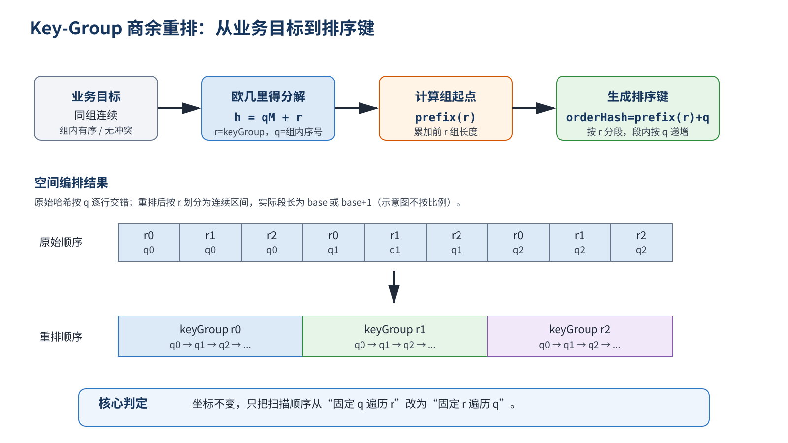
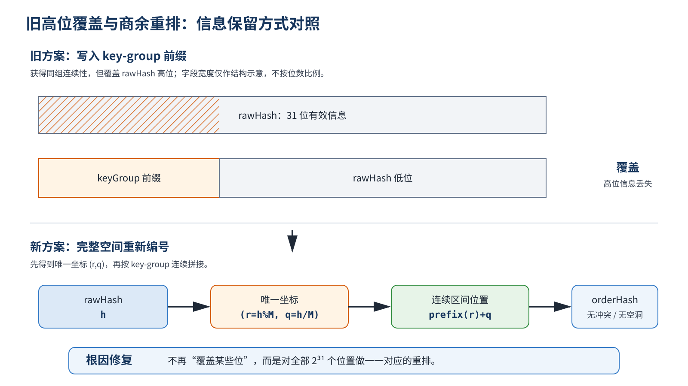
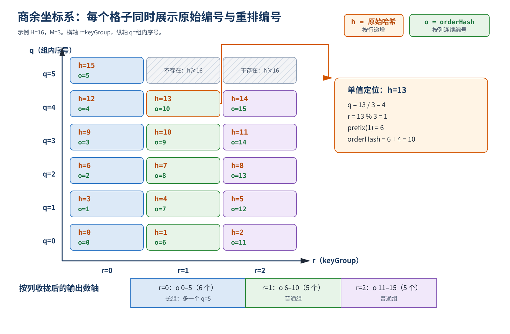
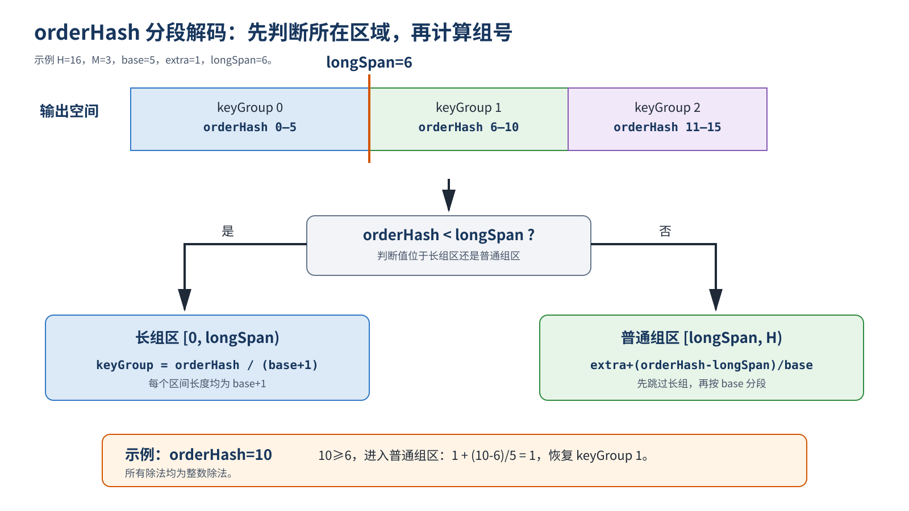
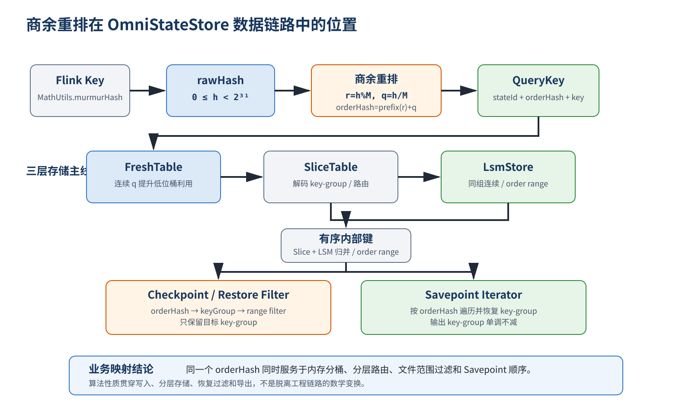

# Key-Group 商余重排算法

> 适用提交：`75453e4a1a3d8461a2e0ec5c4c476c70464ab2c4`
>
> 文档定位：说明普通状态的 `rawHash → orderHash → keyGroup` 映射。Priority Queue（PQ）保留独立编码，不在本算法范围内。

## 1. 一页结论

旧方案把 key-group 写入哈希高位，代价是覆盖部分原始哈希；当 `maxParallelism` 较大时，不同 `rawHash` 可能得到相同编码，同一 key-group 也只能利用少量 FreshTable 桶。

新方案不改哈希空间大小，而是对完整 31 位空间做一次无损重排：

```text
h = qM + r

r = h % M                  // keyGroup
q = h / M                  // 组内序号
orderHash = prefix(r) + q  // 第 r 组起点 + 组内偏移
```

| 目标 | 结果 |
| --- | --- |
| 信息完整 | `[0, 2^31)` 上一一映射，无覆盖、无冲突 |
| 同组连续 | 每个 key-group 映射到一个连续 `orderHash` 区间 |
| 组内稳定 | 同组内 `rawHash` 与 `orderHash` 顺序一致 |
| 可逆分组 | 可从 `orderHash` 直接恢复 key-group |
| 空间不变 | 不增加内部键长度，不增加单条 KV 存储 |
| 快速路径 | `M` 为二次幂时化简为移位和按位或 |

**图 1　算法总览**



> **须知：**
>商余重排不是重新计算哈希，而是把原来的“**按商逐行排列**”改成“**按余数逐列排列**”。

## 2. 背景：既要保留哈希，又要让 key-group 连续

Flink 按下式划分 Keyed State：

```text
keyGroup = hash(key) % maxParallelism
```

OmniStateStore 的内部排序键同时服务于写入、分层存储、文件过滤和 Savepoint 迭代，因此需要满足以下要求：

| 维度 | 必要性质 |
| --- | --- |
| 哈希语义 | 相同业务 key 编码稳定；不同 31 位哈希不因编码丢失信息 |
| 排序语义 | 先按 key-group 排列，同组内再按原始哈希排列 |
| 恢复语义 | Checkpoint/Restore、Savepoint 能从内部键恢复 key-group |
| 存储语义 | 固定 key-group 时仍能充分变化低位，避免 FreshTable 桶退化 |

令：

```text
H = 2^31
M = maxParallelism, 1 <= M <= 32768
h = rawHash,        0 <= h < H
```

> **须知：**
>本文中的 `/` 均表示非负整数除法，`%` 表示与之对应的非负余数。

目标是构造 `E_M: [0,H) → [0,H)`。对任意不同输入 `h1、h2`，排序关系满足：

```text
E_M(h1) < E_M(h2)
⇔
(h1 % M, h1) <lex (h2 % M, h2)
```

同时存在解码函数 `D_M`：

```text
D_M(E_M(h)) = h % M
```

### 2.1 旧方案的问题根因

普通状态在改造前复用 PQ 的 1～2 字节前缀编码，把 key-group 写入哈希高位：

```text
M < 129:   orderHash = (rawHash & 0x00FFFFFF) | (keyGroup << 24)
M >= 129:  orderHash = (rawHash & 0x0000FFFF) | (keyGroup << 16)
```

**图 2　旧高位覆盖与新商余重排对照**



以 `M=32768=2^15` 为例，固定 key-group 后，`rawHash` 的低 15 位已经固定；旧 2 字节编码只保留低 16 位，因此组内序号实际只剩 1 位。直接后果是：

- 不同 `rawHash` 可能映射到同一 `orderHash`；
- 固定 key-group 的数据集中到少量 FreshTable 低位桶；
- 被覆盖的原始信息无法恢复。

根因不是“位数不够”，而是用覆盖信息的方式制造排序前缀。正确方向应是重排完整空间。

## 3. 从欧几里得除法推导编码

### 3.1 把一维哈希拆成二维坐标

欧几里得除法保证：对任意 `h` 和正整数 `M`，存在唯一的商 `q` 和余数 `r`：

```text
h = qM + r
0 <= r < M
```

在本算法中：

| 数学量 | 工程语义 |
| --- | --- |
| `r=h%M` | key-group |
| `q=h/M` | 当前 key-group 内的顺序 |
| `(r,q)` | `rawHash` 的无损二维坐标 |

**图 3　商余坐标系与输出区间**



图中原始 `h` 按行递增；改为按列读取后，同一余数 `r` 聚集为一个连续区间。格子没有移动，改变的是扫描顺序。

### 3.2 计算每组长度

`H` 不一定能被 `M` 整除。对哈希空间再次做欧几里得分解：

```text
H = base * M + extra

base  = H / M
extra = H % M
0 <= extra < M
```

前 `extra` 个 key-group 各多一个元素：

```text
len(r) = base + 1,  r < extra
len(r) = base,      r >= extra
```

这不是人为分配，而是 `[0,H)` 中各余数出现次数的自然结果。

### 3.3 计算组起点

第 `r` 组之前有 `r` 个基础长度，并包含 `min(r,extra)` 个额外元素，因此：

```text
prefix(r) = r * base + min(r, extra)
```

`prefix(r)` 是第 `r` 个 key-group 在输出空间中的起点。

### 3.4 编码公式

将组起点与组内偏移相加：

```text
q = h / M
r = h % M

E_M(h)
= prefix(r) + q
= r * base + min(r, extra) + q
```

这就是商余重排的通用公式。

### 3.5 缩小示例：`H=16、M=3`

初始化：

```text
base  = 16 / 3 = 5
extra = 16 % 3 = 1
```

因此第 0 组长度为 6，第 1、2 组长度为 5：

| key-group `r` | 原始哈希 `h=qM+r` | 输出区间 |
| ---: | --- | --- |
| 0 | 0, 3, 6, 9, 12, 15 | `orderHash=[0, 5]` |
| 1 | 1, 4, 7, 10, 13 | `orderHash=[6, 10]` |
| 2 | 2, 5, 8, 11, 14 | `orderHash=[11, 15]` |

对单值 `h=13`：

```text
q = 13 / 3 = 4
r = 13 % 3 = 1
prefix(1) = 1 * 5 + min(1,1) = 6
orderHash = 6 + 4 = 10
```

结果落在 key-group 1 区间的最后一个位置，与图 3 一致。

## 4. 从 orderHash 恢复 key-group

前 `extra` 个长组占据：

```text
longSpan = extra * (base + 1)
```

据此把输出空间分成两段：

```text
                  orderHash / (base + 1),                  orderHash < longSpan
D_M(orderHash) =
                  extra + (orderHash - longSpan) / base,   orderHash >= longSpan
```

**图 4　orderHash 分段解码**



在 `H=16、M=3` 的示例中，`longSpan=6`。由于 `orderHash=10>=6`：

```text
keyGroup = 1 + (10 - 6) / 5 = 1
```

解码结果等于原始 `13%3`。

## 5. 二次幂快速路径

当 `M=2^g` 时，`H=2^31` 可被 `M` 整除，因此：

```text
base = 2^(31-g)
extra = 0
```

此时商余重排等价于交换 `rawHash` 的两个位段：

```text
rawHash   = [ quotient: 31-g 位 ][ keyGroup: g 位 ]
orderHash = [ keyGroup: g 位 ][ quotient: 31-g 位 ]
```

公式可化简为：

```cpp
orderHash = (keyGroup << (31 - g)) | (rawHash >> g);
keyGroup = orderHash >> (31 - g);
```

二次幂路径只是通用公式在 `extra=0` 时的等价优化，不改变排序语义。

## 6. 正确性

设第 `r` 组对应区间：

```text
I_r = [prefix(r), prefix(r) + len(r))
```

| 要证明的性质 | 依据 |
| --- | --- |
| 输入坐标唯一 | 欧几里得除法保证每个 `h` 唯一对应 `(r,q)` |
| 组内无冲突 | 固定 `r` 后，`orderHash=prefix(r)+q`，不同 `q` 得到不同结果 |
| 组内有序 | `h=qM+r` 与 `orderHash=prefix(r)+q` 都随 `q` 严格递增 |
| 组间无冲突 | `prefix(r+1)=prefix(r)+len(r)`，相邻区间首尾相接且不重叠 |
| 完整覆盖 | `extra*(base+1)+(M-extra)*base=H`，全部区间总长等于哈希空间 |
| 输出不越界 | 所有区间从 0 连续覆盖到 `H`，故 `0<=orderHash<H` |
| 分组可恢复 | `E_M(h)` 落在唯一的 `I_r` 中，分段解码按该区间长度返回 `r=h%M` |

因此 `E_M` 是 `[0,H)` 上的双射，并同时满足：

```text
D_M(E_M(h)) = h % M

E_M(h1) < E_M(h2)
⇔
(h1 % M, h1) <lex (h2 % M, h2)
```

## 7. 代码实现

### 7.1 数学量与成员变量

| 数学量 | 代码成员 | 初始化位置 |
| --- | --- | --- |
| `M` | `mMaxParallelism` | `KeyGroupUtil::Init` |
| `H/M` | `mBase` | `KeyGroupUtil::Init` |
| `H%M` | `mExtra` | `KeyGroupUtil::Init` |
| `extra*(base+1)` | `mLongSpan` | `KeyGroupUtil::Init` |
| `g` | `mGroupBits` | `KeyGroupUtil::Init` |
| `31-g` | `mQuotientBits` | `KeyGroupUtil::Init` |

核心文件：

- `src/core/common/util/key_group_util.cpp`
- `src/core/common/util/key_group_util.h`

`Init` 根据 `M` 是否为二次幂安装通用函数或快速函数，调用侧无需区分路径。

### 7.2 通用编码

`SetGeneralKeyGroup` 与公式逐项对应：

```cpp
uint64_t quotient = rawHash / mMaxParallelism;
uint64_t extraBefore = keyGroup < mExtra ? keyGroup : mExtra;
uint64_t prefix = static_cast<uint64_t>(keyGroup) * mBase + extraBefore;
rawHash = static_cast<uint32_t>(prefix + quotient);
```

中间量使用 `uint64_t`，最终结果已由双射证明保证落在 31 位空间内。

### 7.3 通用解码

`ComputeGeneralKeyGroup` 按长组区和普通组区分段：

```cpp
uint64_t value = orderHash;
if (value < mLongSpan) {
    return static_cast<uint32_t>(value / (mBase + 1));
}
return static_cast<uint32_t>(mExtra + (value - mLongSpan) / mBase);
```

### 7.4 写入入口

`src/core/kv_table/boost_state_table.cpp` 中，`AbstractTable::GetStateId` 的关键顺序是：

```cpp
uint32_t keyGroupIndex = keyHashCode % mMaxParallelism;
KeyGroupUtil::SetKeyGroup(keyHashCode, keyGroupIndex);
return mStateIdHelper->GetStateId(keyGroupIndex);
```

> **须知：**
>必须先从 `rawHash` 保存 `keyGroupIndex`，再把 `keyHashCode` 原地改写为 `orderHash`。后续构造 `QueryKey` 使用改写后的哈希，获取 `stateId` 使用已保存的 key-group。

### 7.5 PQ 兼容边界

PQ 继续使用：

```text
SetPQKeyGroup
ComputePQKeyGroupForKeyHash
```

> **须知：**
>状态过滤和 Savepoint 迭代根据 `StateType::PQ` 选择 PQ 解码；普通状态使用商余重排。两条编码协议不能混用。

## 8. 业务映射

**图 5　商余重排在 OmniStateStore 数据链路中的位置**



| 链路 | 使用方式 | 算法收益 |
| --- | --- | --- |
| KV Put/Get/Remove | `rawHash` 计算 key-group 后编码进 `QueryKey` | 相同 key 生成稳定内部键，写查路径一致 |
| FreshTable | 使用 `orderHash` 低位选桶 | 固定 key-group 时 `q` 连续变化，可利用更多低位桶 |
| SliceTable / LsmStore | 按内部键排序、归并和路由 | 同组数据落在连续范围，文件 order range 与 key-group range 对齐 |
| Checkpoint / Restore | 从 `orderHash` 解码 key-group 后执行范围过滤 | 过滤结果与写入时的 `rawHash%M` 一致 |
| Savepoint | 迭代内部有序数据并恢复 key-group | 输出 key-group 单调不减 |

相关调用点包括：

- `src/core/lsm_store/file/state_filter_manager.h`
- `src/core/lsm_store/file/file_meta_state_filter.h`
- `src/core/snapshot/binary_key_value_Item_iterator.cpp`

## 9. 验证与边界

提交中的测试覆盖：

| 测试 | 验证内容 |
| --- | --- |
| `KvEncodingRoundTripsRepresentativeParallelism` | 二次幂、非二次幂、阈值和最大并行度下可恢复且不越界 |
| `KvOrderIsLexicographicByGroupThenRawHash` | `orderHash` 等价于按 `(keyGroup,rawHash)` 排序 |
| `PowerOfTwoLayoutMatchesExpectedBits` | 快速路径位布局与通用公式一致 |
| `FixedGroupUsesAllAvailableFreshBuckets` | 固定 key-group 的 FreshTable 桶利用 |
| `PqEncodingRemainsByteCompatible` | PQ 独立编码保持兼容 |
| `InitRejectsInvalidParallelismWithoutChangingValidState` | 非法初始化不污染有效状态 |
| `KvOutputIsMonotonicByKeyGroup` | Savepoint 端到端输出按 key-group 单调 |

工程边界：

| 项目 | 约束 |
| --- | --- |
| 哈希空间 | 仅使用非负 31 位空间 `[0,2^31)` |
| 并行度 | `1<=maxParallelism<=32768` |
| 编解码参数 | 编码与解码必须使用相同 `maxParallelism` |
| 状态类型 | 普通状态与 PQ 使用各自协议 |
| 复杂度 | 编码、解码均为 `O(1)`，单条 KV 额外空间为 0 |
