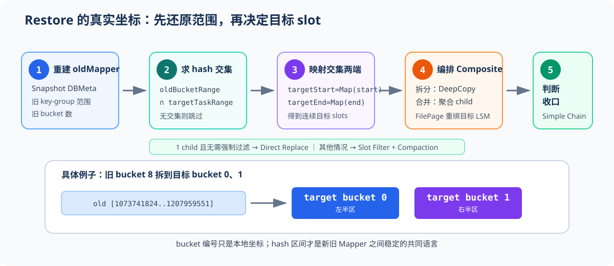
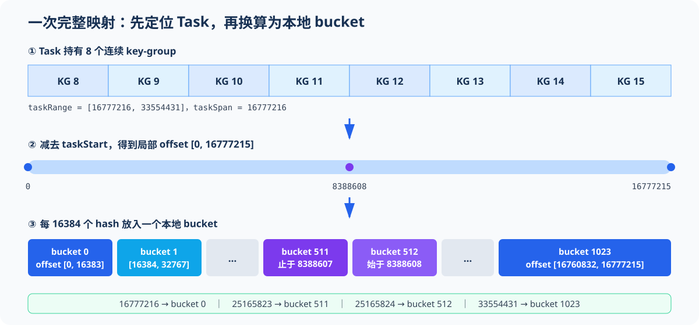
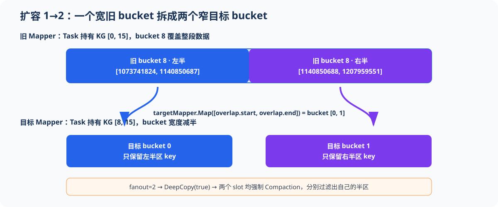
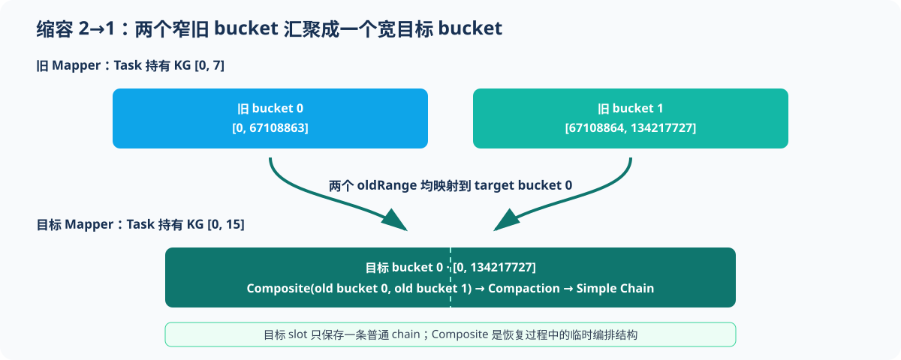
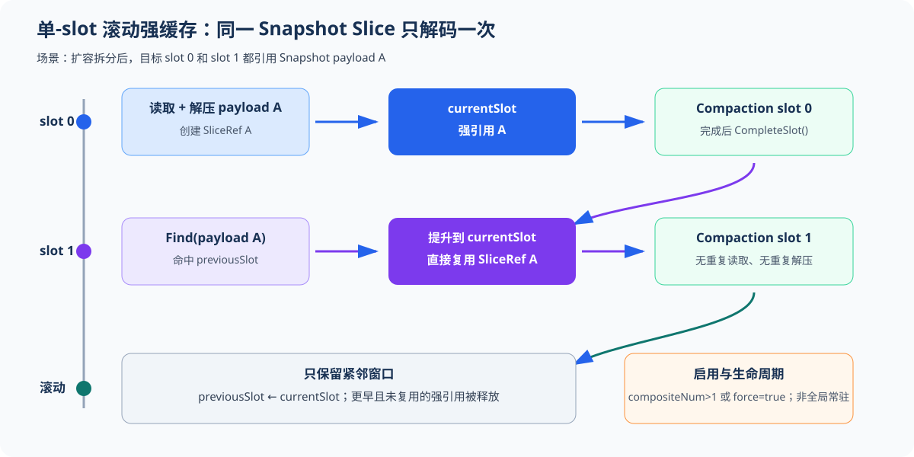

# Task-Local Slice Bucket Mapper 与扩缩容恢复

> 对应实现：`6b360bd40d589d32c98a8095f747a100968a83e6`
>
> 记法：闭区间写作 `[start, end]`；hash 数值不使用千分位分隔符。

## 1. 先看结论：bucket 编号相同，不代表数据范围相同

每个 Subtask 都有一张长度为 `bucketNum` 的本地 Slice Bucket 表，编号均为 `[0, bucketNum-1]`。Mapper 将该 Subtask 拥有的连续 `orderHash` 区间等分到这张表中。

因此，并行度变化后：

- 旧 Subtask 与目标 Subtask 的 hash 范围不同；
- 两侧虽然都有 bucket 0、bucket 1，但同号 bucket 通常不覆盖同一段数据；
- Restore 必须比较 hash 区间，不能直接复制同号 bucket。



一句话概括恢复算法：

```text
旧 bucket 的 hash 区间
    ∩ 目标 Task 的 hash 区间
        → 用 targetMapper 映射交集两端
            → 得到目标 bucket 范围
                → 组装 Composite Chain
                    → 单 child 且无需强制过滤：直接替换
                    → 其他情况：按目标 slot 过滤并 Compaction
```

## 2. 一个完整的 Mapper 映射示例

本节使用实现 UT 中的参数，完整走一遍初始化、正向映射和反向查询：

```text
maxParallelism = 1024
startKeyGroup  = 8
endKeyGroup    = 15
bucketNum      = 1024
```

这里的 `orderHash` 不是原始 key hash。写入路径先用 `rawHash % maxParallelism` 得到 key-group，再由 `KeyGroupUtil::SetKeyGroup()` 按商余重排规则改写 hash；`maxParallelism` 为二次幂时使用等价的位移快路径。改写保持 key-group 归属不变，同时让同一 key-group 的 hash 在 `[0, 2^31-1]` 上连续。Mapper 的输入是重排后的 `orderHash`。

本例中，当前 Task 持有 8 个连续 key-group，每个 key-group 覆盖 `2^21` 个 `orderHash`。以下为 Task hash 范围和本地 bucket span 的计算示例：

```text
taskRange = [16777216, 33554431]
taskSpan  = 16777216
bucketSpan = taskSpan / bucketNum = 16384
```



### 2.1 正向映射：一个 hash 落到哪个 bucket

实现先减去 Task 起点，再按 Task 跨度缩放：

```text
offset = orderHash - taskStart
bucket = floor(offset × bucketNum / taskSpan)
```

本例中 `bucketSpan=16384=2^14`，所以热路径退化为右移：

```text
bucket = offset >> 14
```

| orderHash | 局部 offset | 计算 | bucket |
| ---: | ---: | --- | ---: |
| 16777216 | 0 | `0 >> 14` | 0 |
| 16793600 | 16384 | `16384 >> 14` | 1 |
| 25165823 | 8388607 | `8388607 >> 14` | 511 |
| 25165824 | 8388608 | `8388608 >> 14` | 512 |
| 33554431 | 16777215 | `16777215 >> 14` | 1023 |

这说明 bucket 是 **Task 局部编号**：`16777216` 在该 Task 中映射到 bucket 0，而不是用全局 hash 直接对 1024 取模。

### 2.2 反向查询：一个 bucket 覆盖哪些 hash

`GetBucketRange(b)` 使用向上取整恢复闭区间：

```text
start(b) = taskStart + ceil(b × taskSpan / bucketNum)
end(b)   = taskStart + ceil((b + 1) × taskSpan / bucketNum) - 1
```

| bucket | hash 闭区间 |
| ---: | --- |
| 0 | `[16777216, 16793599]` |
| 1 | `[16793600, 16809983]` |
| 511 | `[25149440, 25165823]` |
| 512 | `[25165824, 25182207]` |
| 1023 | `[33538048, 33554431]` |

正向映射使用 `floor`，反向边界使用 `ceil`。两者来自同一整数区间划分，所以相邻 bucket 首尾相接、没有空洞和重叠，长度最多相差 1。

## 3. Mapper 如何从 key-group 推导 hash 区间

### 3.1 并行度决定 Subtask 的 key-group 范围

Flink 将 `maxParallelism=M` 个 key-group 连续分配给并行度为 `P` 的 Subtask。第 `i` 个 Subtask 持有：

```text
startKeyGroup(i) = ceil(i × M / P)
endKeyGroup(i)   = ceil((i + 1) × M / P) - 1
```

例如 `M=16`、`P=2`：

| Subtask | key-group |
| ---: | --- |
| 0 | `[0, 7]` |
| 1 | `[8, 15]` |

这就是后续扩容示例中目标 Subtask 1 获得 `[8, 15]`、缩容示例中旧 Subtask 0 持有 `[0, 7]` 的来源。

### 3.2 key-group 范围决定 Task hash 范围

令：

```text
H = 2^31
M = maxParallelism
base  = H / M
extra = H % M
```

第 `g` 个 key-group 在重排后 hash 轴上的起点为：

```text
GroupStart(g) = g × base + min(g, extra)
```

`extra` 不能丢。它把除法余数逐个补给前 `extra` 个 key-group，使整个 `[0, 2^31-1]` 恰好被覆盖。

对 Task 的 key-group 闭区间 `[startKeyGroup, endKeyGroup]`：

```text
taskStart = GroupStart(startKeyGroup)
taskEnd   = GroupStart(endKeyGroup + 1) - 1
taskSpan  = taskEnd - taskStart + 1
```

Mapper 随后只在 `[taskStart, taskEnd]` 内建立本地 bucket 坐标系。`Map()` 校验输入是否在该区间；`MapUnchecked()` 省略校验，仅供调用方已确认范围的热路径。

## 4. 业务映射：扩容时为什么一拆多

第 2 节使用 1024 个 bucket 验证真实计算；为了直观看清拆分边界，本节将参数缩小为 `maxParallelism=16`、`bucketNum=16`，映射公式不变。`parallelism 1→2` 时，旧 Subtask 0 持有 `[0, 15]`，目标 Subtask 1 持有 `[8, 15]`。

| Mapper | key-group | Task hash 范围 | 单 bucket 宽度 |
| --- | --- | --- | ---: |
| 旧 Mapper | `[0, 15]` | `[0, 2147483647]` | 134217728 |
| 目标 Mapper | `[8, 15]` | `[1073741824, 2147483647]` | 67108864 |

旧 bucket 8 的范围为：

```text
oldBucket8 = [1073741824, 1207959551]
```

目标 Task 从同一位置开始，但 bucket 宽度减半，对应的 bucket 范围如下：

```text
targetBucket0 = [1073741824, 1140850687]
targetBucket1 = [1140850688, 1207959551]
```



代码不枚举 bucket 内的 key，而是只映射交集端点：

```text
overlapStart = max(oldRange.start, targetTaskRange.start)
overlapEnd   = min(oldRange.end,   targetTaskRange.end)

targetStart = targetMapper.MapUnchecked(overlapStart) = 0
targetEnd   = targetMapper.MapUnchecked(overlapEnd)   = 1
fanout      = 2
```

同一旧 chain 被编排到两个目标 slot。实现对每份执行 `DeepCopy(true)`，并设置 `RequireForceCompaction=true`。原因是每份副本仍含旧 bucket 的全部 key，必须通过目标 slot filter 分别留下左右半区。

## 5. 业务映射：缩容时为什么多并一

反过来观察 `parallelism 2→1`。旧 Subtask 0 持有 key-group `[0, 7]`，目标 Subtask 0 持有 `[0, 15]`，仍使用 16 个本地 bucket。

| Mapper | key-group | Task hash 范围 | 单 bucket 宽度 |
| --- | --- | --- | ---: |
| 旧 Mapper | `[0, 7]` | `[0, 1073741823]` | 67108864 |
| 目标 Mapper | `[0, 15]` | `[0, 2147483647]` | 134217728 |

前两个旧 bucket 恰好覆盖一个目标 bucket：

```text
oldBucket0    = [0, 67108863]
oldBucket1    = [67108864, 134217727]
targetBucket0 = [0, 134217727]
```



两个旧 chain 都被加入目标 slot 0，形成 `CompositeLogicalSliceChain`。`GetCompositeNum()==2`，Restore 必须执行同步 Compaction，输出一个普通 `LogicalSliceChain`。

### 5.1 只有一个 child，也可能必须 Compaction

Task 边界可能从旧 bucket 中间穿过。实现 UT 中有如下边界：

```text
oldBucket341   = [715128832, 717225983]
targetTaskStart = 715827883
overlap         = [715827883, 717225983]
```

交集只落入一个目标 bucket，`fanout=1`，但旧 chain 仍含 `[715128832, 715827882]` 的越界数据。因此，是否需要 Compaction 不能只看 child 数量，还要参考以下条件：

```text
rangeClipped = overlap != oldBucketRange
requireForceCompaction = fanout > 1 || rangeClipped
```

最终 slot filter 删除两类 key：

```text
hash 不在目标 Task 范围
或
targetMapper.MapUnchecked(hash) != 当前 slot
```

## 6. Restore 中旧目标 Mapper 如何协作

| 阶段 | 实际动作 | 关键结果 |
| ---: | --- | --- |
| 1 | 从 Snapshot DBMeta 读取旧 key-group 范围和 bucket 数 | 重建 `oldMapper` |
| 2 | 用当前配置初始化 `SliceBucketIndex` | 获得 `targetMapper` |
| 3 | 遍历非空旧 bucket，并与目标 Task 范围求交 | 跳过无关数据 |
| 4 | 用目标 Mapper 映射交集起止 hash | 得到连续目标 slot 范围 |
| 5 | 拆分时深拷贝，合并时聚合 child，并重绑 FilePage 的 LsmStore | 建立 Composite Chain |
| 6 | 加载 Snapshot Slice，判断 `childNum==1 && !requireForceCompaction` | 满足时直接替换，否则进入 Compaction |
| 7 | 按目标 slot 过滤或合并，并用普通 `LogicalSliceChain` 替换 Composite Chain | Restore 收口 |

> **说明：**
>算法只依赖 hash 区间交集，不要求新旧并行度互为整数倍。因此一对一、一拆多、多并一和 Task 边界裁剪共用同一条代码路径。

## 7. 单-slot 滚动强缓存

实现按以下条件启用滚动强缓存：

```text
useRollingCache = compositeNum > 1 || requireForceCompaction
```

因此它覆盖一拆多、多并一和边界裁剪；只有单 child 且无需强制过滤的直接替换路径会清空缓存。一拆多的复用收益最直观，因为相邻目标 slot 会引用同一份 Snapshot Slice；若每个 slot 都重新读取、解压，扩容倍数会直接放大恢复 I/O 和解压开销。



以旧 chain 同时进入目标 slot 0、1 为例：

| 时刻 | `previousSlot` | `currentSlot` | 动作 |
| --- | --- | --- | --- |
| 开始 slot 0 | 空 | 空 | 读取并解压 Slice A，放入 `currentSlot` |
| slot 0 Compaction 后 | Slice A | 空 | `CompleteSlot()` 将当前窗口滚为上一窗口 |
| 开始 slot 1 | Slice A | 空 | `Find()` 命中并提升到 `currentSlot`，不再解压 |
| slot 1 加载后 | 清理未复用项 | Slice A | `ClearPreviousSlot()` 释放旧窗口残留 |
| slot 1 Compaction 后 | Slice A | 空 | 窗口继续滚动，只服务紧邻的下一 slot |

缓存键使用 Snapshot payload 的物理身份：

```text
localAddress + startOffset + rawLength + storedLength + compressAlgo + checkSum
```

缓存保存 `SliceRef` 强引用，保证共享解码 Buffer 在当前 slot Compaction 完成前有效；窗口只保留当前 slot 和紧邻上一 slot，避免演变为全局常驻缓存。

分配解码内存前，`EnsureSliceRestoreMemory()` 同时计算原始 Buffer 和压缩临时 Buffer。容量不足时先释放 `previousSlot`，再尝试同步淘汰；单份 payload 的工作集超过 SliceTable 总容量时返回 `BSS_ALLOC_FAIL`。

## 8. 实现对应关系

| 关注点 | 实现 |
| --- | --- |
| 原始 hash 到 `orderHash` 的商余重排 | `AbstractTable::GetStateId`、`KeyGroupUtil::SetKeyGroup` |
| Task hash 范围、正反映射、移位快路径 | `SliceBucketMapper::Initialize/Map/MapUnchecked/GetBucketRange` |
| 当前 Task 的目标 Mapper | `SliceBucketIndex::Initialize` |
| Snapshot 旧 Mapper 重建 | `SliceTableRestoreOperation::RestoreSliceBucketIndex` |
| 旧 bucket 与目标 Task 求交、拆分和聚合 | `BucketGroupRescaleUtil::Rescale` |
| 目标 slot 数据过滤 | `SliceBucketIndex::GetSlotStateFilter` |
| Slice 解码复用与内存让渡 | `DataSliceRestoreCache`、`EnsureSliceRestoreMemory` |
| Composite 同步合并并替换 | `CompactCompositeLogicalSliceChain`、`ReplaceCompositeLogicalSlice` |

## 9. 正确性边界

- `maxParallelism`、key-group 范围和 `bucketNum` 必须合法，且 `taskSpan>=bucketNum`。
- 当前实现要求新旧 Slice Bucket 数相同，否则返回 `BSS_NOT_SUPPORTED`。
- 当前 Rescale 只支持一个 `bucketGroupId=0` 的 BucketGroup。
- `Map()` 拒绝 Task 范围外的 hash；`MapUnchecked()` 仅用于已完成范围判断的路径。
- Mapper 只接收商余重排后的 `orderHash`，不能直接传入原始 key hash。
- 一拆多必须深拷贝元数据，避免多个目标 slot 修改同一旧 chain。
- `fanout>1` 或 Task 边界裁剪时必须强制过滤；多个 child 汇聚时必须合并。
- 单 child 且 `RequireForceCompaction=false` 时直接替换，不执行 Compaction。
- Restore 结束后不允许残留 `CompositeLogicalSliceChain`，否则返回 `BSS_INNER_ERR`。
- 过滤结果为空时保留合法空 chain，不生成零长度 `SliceAddress`。

这套实现的核心不在“重新编号”，而在于用 Mapper 把新旧本地编号还原到同一条 hash 坐标轴，再以区间交集完成可证明的拆分、合并和过滤。
